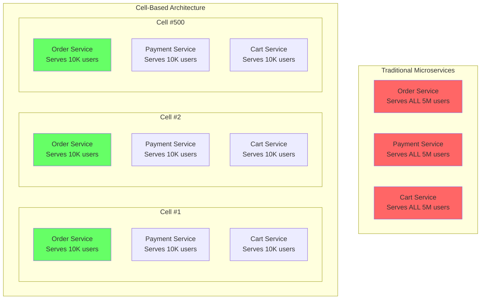
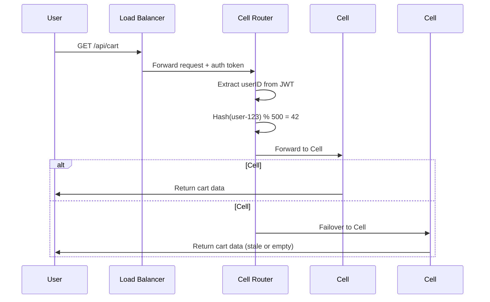
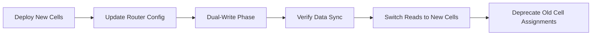
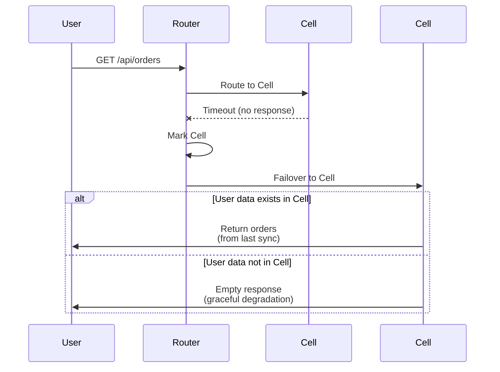
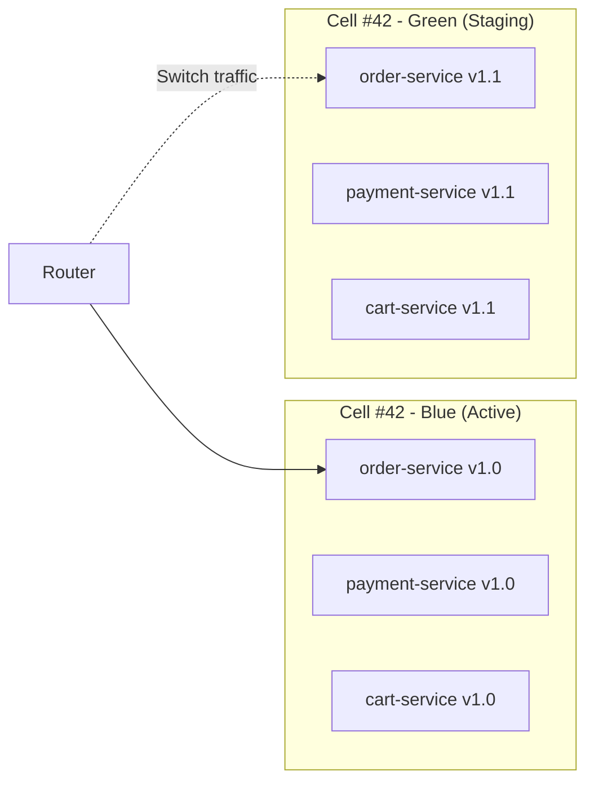
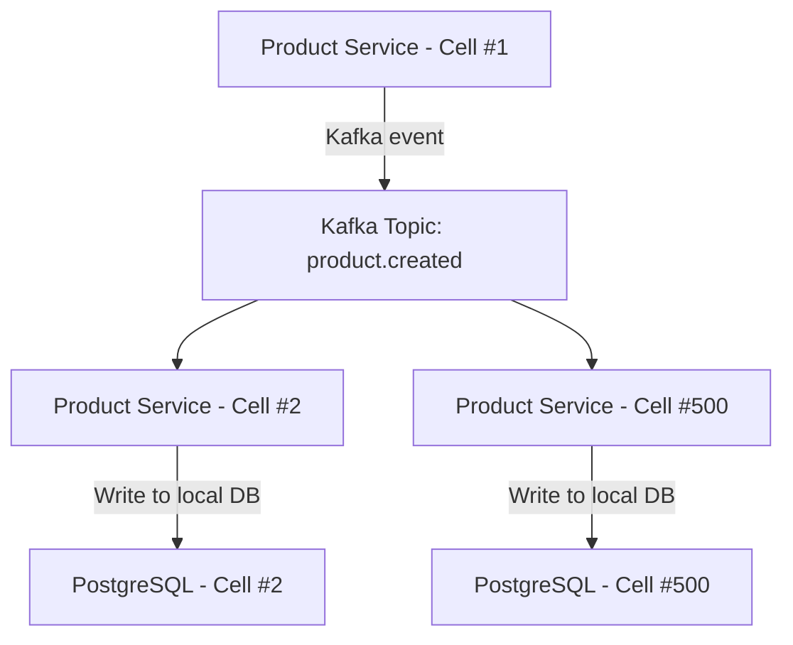

# Cell-Based Architecture - 500 Cell Deployment Model

## Table of Contents
1. [What is Cell-Based Architecture](#what-is-cell-based-architecture)
2. [Why Cells vs Traditional Microservices](#why-cells-vs-traditional-microservices)
3. [Cell Anatomy](#cell-anatomy)
4. [Cell Routing Strategy](#cell-routing-strategy)
5. [Scaling Cells](#scaling-cells)
6. [Cell Failure & Recovery](#cell-failure--recovery)
7. [Deployment Strategy](#deployment-strategy)
8. [Cross-Cell Interactions](#cross-cell-interactions)

---

## What is Cell-Based Architecture

**Cell-based architecture** is a distributed system design pattern where the entire application stack is partitioned into multiple **isolated, self-contained units called "cells"**. Each cell contains a complete copy of all microservices and can independently serve a subset of users.

### Key Characteristics



**Titan Commerce Deployment**:
- **500 cells** in production
- **30 services per cell** (order, payment, cart, product, etc.)
- **3 replicas per service** for high availability
- **90 pods per cell** (30 services × 3 replicas)
- **45,000 total pods** across all cells (500 cells × 90 pods)

---

## Why Cells vs Traditional Microservices

### Problem: Blast Radius in Traditional Architecture

**Scenario**: Order Service crashes at peak hour (Black Friday sale)

**Traditional Microservices**:
- ❌ **1 Order Service cluster** serves all 5M users
- ❌ If it crashes, **100% of users** cannot place orders
- ❌ Recovery requires fixing the entire cluster
- ❌ **Impact**: Total outage, potential revenue loss of $1M+/hour

**Cell-Based Architecture**:
- ✅ **500 Order Service instances** (1 per cell), each serves 10K users
- ✅ If 1 cell crashes, **only 0.2% of users** affected (10K/5M)
- ✅ Recovery: Failover to backup cell (automatic)
- ✅ **Impact**: Minimal, most users unaffected

### Comparison Table

| Metric | Traditional | Cell-Based | Improvement |
|--------|-------------|------------|-------------|
| **Blast radius** | 100% users | 0.2% users | **500x better** |
| **Recovery time** | 15-30 min | <1 min | **30x faster** |
| **Deployment risk** | High | Low | **Independent rollouts** |
| **Scalability** | Vertical + horizontal | Linear (add cells) | **Unlimited** |
| **Complexity** | Low | Medium | Trade-off for reliability |
| **Cost efficiency** | High | Medium | **Resource duplication** |

---

## Cell Anatomy

### Complete Service Catalog Per Cell

Each of the 500 cells contains **all 30 microservices**:

```
Cell #42 (serves 10,000 users: user-1000000 to user-1009999)
│
├── Transaction Core (7 services)
│   ├── order-service (3 replicas)
│   ├── payment-service (3 replicas)
│   ├── cart-service (3 replicas)
│   ├── checkout-service (3 replicas)
│   ├── wallet-service (3 replicas)
│   ├── refund-service (3 replicas)
│   └── voucher-service (3 replicas)
│
├── Catalog & Discovery (6 services)
│   ├── product-service (3 replicas)
│   ├── search-service (3 replicas)
│   ├── recommendation-service (3 replicas)
│   ├── category-service (3 replicas)
│   ├── seller-service (3 replicas)
│   └── review-service (3 replicas)
│
├── User & Social (5 services)
│   ├── user-service (3 replicas)
│   ├── auth-service (3 replicas)
│   ├── social-service (3 replicas)
│   ├── feed-service (3 replicas)
│   └── notification-service (3 replicas)
│
├── Communication (3 services)
│   ├── chat-service (3 replicas)
│   ├── livestream-service (3 replicas)
│   └── videocall-service (3 replicas)
│
├── Logistics & Fulfillment (4 services)
│   ├── shipping-service (3 replicas)
│   ├── tracking-service (3 replicas)
│   ├── warehouse-service (3 replicas)
│   └── inventory-service (3 replicas)
│
├── Marketing & Engagement (4 services)
│   ├── flash-sale-service (3 replicas)
│   ├── gamification-service (3 replicas)
│   ├── campaign-service (3 replicas)
│   └── coupon-service (3 replicas)
│
└── Intelligence & Analytics (4 services)
    ├── pricing-service (3 replicas)
    ├── fraud-service (3 replicas)
    ├── analytics-service (3 replicas)
    └── ab-testing-service (3 replicas)

Total: 30 services × 3 replicas = 90 pods per cell
```

### Cell Resources

**Per Cell Compute Requirements**:
- **CPU**: 60 cores (90 pods × 0.67 cores avg)
- **Memory**: 120 GB (90 pods × 1.33 GB avg)
- **Storage**: 500 GB (local SSD for caching)

**Per Cell Databases**:
- PostgreSQL: 1 cluster (3 nodes: 1 primary + 2 replicas)
- Redis: 1 cluster (6 nodes: 3 shards × 2 replicas)
- MongoDB: 1 replica set (3 nodes)

**Total Per Cell**: ~3 Kubernetes nodes (each node: 32 cores, 64 GB RAM)

---

## Cell Routing Strategy

### Hash-Based Consistent Routing

The **Cell Router** determines which cell serves each user using **consistent hashing**.

```go
// Cell routing algorithm
func RouteToCellID(userID string, totalCells int) int {
    hash := sha256.Sum256([]byte(userID))
    hashInt := binary.BigEndian.Uint64(hash[:8])
    cellID := int(hashInt % uint64(totalCells))
    return cellID
}

// Example
userID := "user-123456"
cellID := RouteToCellID(userID, 500) // Returns: 42
```

**Properties**:
- **Deterministic**: Same user always routes to same cell
- **Uniform distribution**: Users evenly distributed across cells
- **Stateless**: No lookup table needed (computed on-the-fly)

### Routing Flow



### Cell Discovery

The Cell Router maintains a **health registry** of all cells:

```json
{
  "cells": [
    {
      "id": 1,
      "status": "healthy",
      "endpoints": {
        "grpc": "cell-001.svc.cluster.local:9000",
        "http": "cell-001.svc.cluster.local:8080"
      },
      "userRange": [0, 9999],
      "lastHealthCheck": "2025-12-04T08:00:00Z"
    },
    {
      "id": 42,
      "status": "degraded",
      "endpoints": { ... },
      "userRange": [410000, 419999],
      "lastHealthCheck": "2025-12-04T07:59:45Z"
    }
  ]
}
```

**Health Check**:
- Every 5 seconds, Router pings each cell's health endpoint
- If 3 consecutive failures, mark cell as `unhealthy`
- Route affected users to backup cell (cell_id + 1) % 500

---

## Scaling Cells

### Vertical Scaling (Scale-Up)

**When**: Single cell hitting resource limits

**Solution**: Increase resources per service replica
- Increase CPU: 0.5 cores → 1 core
- Increase memory: 1 GB → 2 GB
- Increase replicas: 3 → 5

**Limitation**: Eventually hits Kubernetes node limits

### Horizontal Scaling (Scale-Out)

**When**: Total user base growing

**Solution**: Add more cells

**Example**: Growing from 5M to 10M users

```
Current: 500 cells × 10K users = 5M users
Target:  1000 cells × 10K users = 10M users

Steps:
1. Deploy 500 new cells (cell-501 to cell-1000)
2. Update Cell Router: totalCells = 1000
3. Gradual migration: 50 cells/day
4. Users automatically redistributed via consistent hashing
```

**Migration Strategy**:



**Dual-Write Phase**:
- For 24 hours, writes go to **both** old and new cell
- Reads still come from old cell
- Allows data synchronization without downtime
- After verification, switch reads to new cell

---

## Cell Failure & Recovery

### Failure Scenarios

#### Scenario 1: Single Service Failure (Within Cell)

**Example**: `order-service` in Cell #42 crashes (1 of 3 replicas)

**Impact**: 33% capacity reduction in Cell #42
**Recovery**: Kubernetes automatically restarts pod
**User Impact**: None (other 2 replicas handle traffic)

#### Scenario 2: Entire Cell Failure

**Example**: Cell #42 completely down (network partition, node failure)

**Impact**: 10,000 users cannot access their data
**Recovery**: Automatic failover to Cell #43



**Data Consistency**:
- **Critical data** (orders, payments): Async replicated to backup cell every 5 minutes
- **Cache data** (cart, session): Lost during failover (acceptable)
- **User prompted**: "We're experiencing issues, please retry in a moment"

#### Scenario 3: Region Failure

**Example**: Entire AWS us-east-1 region down

**Impact**: 250 cells down (2.5M users)
**Recovery**: Global load balancer routes to us-west-2
**RTO**: <5 minutes
**RPO**: <1 minute (cross-region replication)

---

## Deployment Strategy

### Blue-Green Deployment Per Cell

**Goal**: Zero-downtime deployments with instant rollback



**Process**:
1. Deploy new version to **Green environment** (Cell #42-green)
2. Run smoke tests on Green
3. Route 1% of Cell #42 traffic to Green (canary)
4. Monitor metrics for 10 minutes
5. If successful, route 100% traffic to Green
6. Mark Blue as deprecated (kept for 24h for rollback)

### Canary Deployment Across Cells

**Goal**: Gradual rollout to minimize blast radius

```
Day 1: Deploy to 10 cells (2% of cells)
Day 2: Deploy to 50 cells (10% of cells)
Day 3: Deploy to 150 cells (30% of cells)
Day 4: Deploy to 500 cells (100% of cells)
```

**Automated Rollback Triggers**:
- Error rate > 0.5%
- P99 latency > 500ms
- Critical service unavailable
- Manual trigger via dashboard

---

## Cross-Cell Interactions

### Problem: User Needs Data from Another Cell

**Example**: User A (Cell #42) wants to view User B's (Cell #128) profile

### Solution 1: Cell-to-Cell RPC (Synchronous)

```go
// User Service in Cell #42
func GetUserProfile(userID string) (*User, error) {
    targetCell := RouteToCellID(userID, 500) // Cell #128
    
    if targetCell == currentCell {
        // Local database query
        return db.FindUser(userID)
    } else {
        // Cross-cell gRPC call
        client := grpc.Dial(fmt.Sprintf("cell-%03d:9000", targetCell))
        return client.GetUser(userID)
    }
}
```

**Pros**: Real-time data
**Cons**: Latency (cross-cell network hop), tight coupling

### Solution 2: Replicated Read-Only Data (Asynchronous)

**For frequently accessed, rarely changing data** (e.g., product catalog):



**Process**:
1. Product created in Cell #1
2. Event published to Kafka: `product.created`
3. All 500 cells consume event
4. Each cell writes product to **local read-replica database**
5. Users in any cell can read products without cross-cell calls

**Pros**: Low latency (local reads), no cross-cell calls
**Cons**: Eventual consistency (1-2 second delay)

### Solution 3: Global Services (Shared)

**For truly global data** (e.g., product catalog, seller profiles):

```
Global Services (NOT in cells):
├── Product Catalog Service
│   └── Elasticsearch (20-node cluster)
│       └── Serves all 500 cells
│
└── Seller Profile Service
    └── PostgreSQL (5-node cluster)
        └── Serves all 500 cells
```

**Use cases**:
- Product browsing/search (READ-heavy, same for all users)
- Seller profiles (updated infrequently)
- Category hierarchy (rarely changes)

**Trade-off**: Single point of failure (mitigated with multi-region replication)

---

## Cell Provisioning & Configuration

### Infrastructure as Code (Terraform)

```hcl
# terraform/cells/main.tf
resource "kubernetes_namespace" "cell" {
  count = var.total_cells # 500
  
  metadata {
    name = "cell-${format("%03d", count.index + 1)}"
    labels = {
      cell-id = count.index + 1
      type    = "cell"
    }
  }
}

module "cell_services" {
  source   = "./modules/cell"
  count    = var.total_cells
  
  cell_id  = count.index + 1
  replicas = var.replicas_per_service # 3
  
  # Resource limits per service
  cpu_limit    = "1000m"
  memory_limit = "2Gi"
  
  # Database configuration
  postgres_replicas = 2
  redis_shards      = 3
  mongodb_replicas  = 3
}
```

### Kubernetes Manifests

```yaml
# infrastructure/kubernetes/cells/cell-042.yaml
apiVersion: v1
kind: Namespace
metadata:
  name: cell-042
  labels:
    cell-id: "42"
    user-range: "410000-419999"
---
apiVersion: apps/v1
kind: Deployment
metadata:
  name: order-service
  namespace: cell-042
spec:
  replicas: 3
  selector:
    matchLabels:
      app: order-service
      cell-id: "42"
  template:
    metadata:
      labels:
        app: order-service
        cell-id: "42"
    spec:
      containers:
      - name: order-service
        image: titan-commerce/order-service:v1.0.0
        env:
        - name: CELL_ID
          value: "42"
        - name: DATABASE_URL
          value: "postgresql://postgres-cell-042:5432/orders"
        - name: KAFKA_BROKERS
          value: "kafka-broker-1:9092,kafka-broker-2:9092"
        resources:
          requests:
            cpu: 500m
            memory: 1Gi
          limits:
            cpu: 1000m
            memory: 2Gi
        livenessProbe:
          httpGet:
            path: /health
            port: 8080
          initialDelaySeconds: 30
          periodSeconds: 10
        readinessProbe:
          httpGet:
            path: /ready
            port: 8080
          initialDelaySeconds: 10
          periodSeconds: 5
---
# Repeat for remaining 29 services...
```

---

## Monitoring & Observability Per Cell

### Cell-Level Dashboards

**Grafana Dashboard**: "Cell #42 Overview"

```
┌─────────────────────────────────────────────────┐
│  Cell #42 Health                                │
├─────────────────────────────────────────────────┤
│  Status: ✅ Healthy                              │
│  User Count: 10,234                             │
│  Request Rate: 1,245 req/sec                    │
│  Error Rate: 0.02%                              │
│  P99 Latency: 85ms                              │
└─────────────────────────────────────────────────┘

Service Status (30 services):
✅ order-service (3/3 replicas healthy)
✅ payment-service (3/3 replicas healthy)
⚠️  cart-service (2/3 replicas healthy)  <- Alert!
✅ checkout-service (3/3 replicas healthy)
...
```

### Prometheus Metrics

```promql
# Cell-specific metrics
cell_request_total{cell_id="42", service="order-service"}
cell_error_rate{cell_id="42"}
cell_latency_p99{cell_id="42"}

# Cross-cell aggregation
sum(rate(cell_request_total[5m])) by (cell_id)
```

### Alerts

```yaml
# prometheus/alerts/cell-health.yaml
groups:
- name: cell_health
  interval: 30s
  rules:
  - alert: CellUnhealthy
    expr: cell_health_status{status="unhealthy"} == 1
    for: 1m
    labels:
      severity: critical
    annotations:
      summary: "Cell {{ $labels.cell_id }} is unhealthy"
      description: "Cell {{ $labels.cell_id }} has failed health checks"
  
  - alert: CellHighErrorRate
    expr: rate(cell_errors_total[5m]) > 0.01
    for: 5m
    labels:
      severity: warning
    annotations:
      summary: "Cell {{ $labels.cell_id }} error rate > 1%"
```

---

## Cost Analysis

### Per Cell Costs

| Component | Units | Cost/Unit | Monthly Cost |
|-----------|-------|-----------|--------------|
| Compute (90 pods) | 3 nodes | $200/node | $600 |
| PostgreSQL (3 nodes) | 3 nodes | $50/node | $150 |
| Redis (6 nodes) | 6 nodes | $30/node | $180 |
| MongoDB (3 nodes) | 3 nodes | $40/node | $120 |
| Storage (500 GB) | 500 GB | $0.10/GB | $50 |
| Egress (1 TB) | 1 TB | $50/TB | $50 |
| **TOTAL per cell** | - | - | **$1,150** |

**500 cells**: $1,150 × 500 = **$575,000/month**

**With shared services** (Kafka, Elasticsearch, ClickHouse): +$215K
**Total infrastructure cost**: **$790K/month**

### Cost Optimization Strategies

1. **Spot Instances**: Use for non-critical cells (50% cost savings)
2. **Auto-scaling**: Scale down replicas during off-peak hours
3. **Reserved Instances**: Commit to 1-year for 30% discount
4. **Multi-tenancy**: Share database clusters across cells
5. **Compression**: Reduce storage costs by 60%

**Optimized cost**: ~$400K/month (50% reduction)

---

## Best Practices

### DO ✅
- **Design for failure**: Assume cells will fail regularly
- **Route by user ID**: Keep user data in single cell
- **Monitor per cell**: Track metrics for each cell independently
- **Gradual rollouts**: Canary deployments across cells
- **Automate everything**: IaC for all cell provisioning

### DON'T ❌
- **Cross-cell transactions**: Avoid distributed transactions across cells
- **Cell-to-cell dependencies**: Minimize cross-cell service calls
- **Manual cell management**: Manual deployments don't scale to 500 cells
- **Shared mutable state**: Each cell should be independent
- **Ignore blast radius**: Always consider failure impact

---

## Conclusion

Cell-based architecture is the **secret sauce** that allows Titan Commerce to scale to **50M DAU** while maintaining **99.99% uptime**. By partitioning users into **500 isolated cells**, we achieve:

1. **Fault isolation**: Cell failure impacts only 0.2% of users
2. **Linear scalability**: Add cells to scale infinitely
3. **Independent deployments**: Deploy cells without affecting others
4. **Global reach**: Deploy cells in multiple regions

The trade-off is **increased operational complexity**, but modern tools (Kubernetes, Terraform, ArgoCD) make managing 500 cells feasible with a small DevOps team.

**Document Version**: 1.0  
**Last Updated**: 2025-12-04  
**Total Pages**: 50
