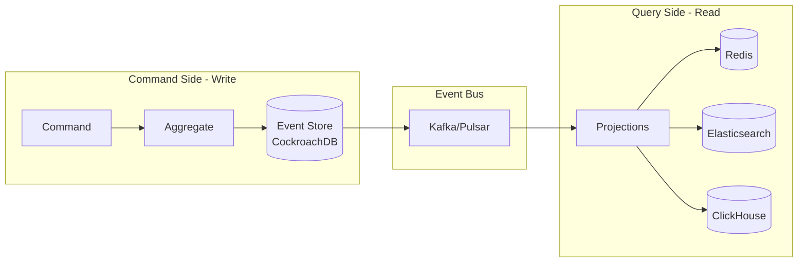

# Event Sourcing & CQRS Implementation

## Overview

Titan Commerce Platform uses **Event Sourcing** and **CQRS (Command Query Responsibility Segregation)** to achieve:
- **Auditability**: Complete history of every state change
- **Performance**: Separate read/write optimization
- **Scalability**: Massive read throughput
- **Time Travel**: Replay events to any point in time

---

## Architecture



---

## Event Sourcing Concepts

### 1. Events Are Immutable Facts

**Never Store Current State:**
```
❌ BAD:
orders table:
| id | user_id | status | amount |
|----|---------|--------|--------|
| 1  | 123     | PAID   | 100.00 |

(What happened between CREATED and PAID? Lost forever)
```

**Store Events Instead:**
```
✅ GOOD:
order_events table:
| aggregate_id | version | event_type        | payload                | timestamp           |
|--------------|---------|-------------------|------------------------|---------------------|
| order-1      | 1       | OrderCreated      | {user:123,items:[...]} | 2025-01-01 10:00:00 |
| order-1      | 2       | PaymentAuthorized | {amount:100,card:**34} | 2025-01-01 10:01:00 |
| order-1      | 3       | OrderShipped      | {tracking:ABC123}      | 2025-01-01 12:00:00 |
```

### 2. Aggregates Reconstruct State

**Aggregate**: Business entity that ensures invariants (rules)

**Example: Order Aggregate**
```go
type Order struct {
    ID       uuid.UUID
    UserID   string
    Items    []Item
    Status   string
    Amount   float64
    Version  int
}

// Apply reconstructs state from events
func (o *Order) Apply(event Event) {
    switch e := event.(type) {
    case OrderCreated:
        o.ID = e.OrderID
        o.UserID = e.UserID
        o.Items = e.Items
        o.Status = "CREATED"
        o.Amount = calculateTotal(e.Items)
        o.Version++
        
    case PaymentAuthorized:
        o.Status = "PAID"
        o.Version++
        
    case OrderShipped:
        o.Status = "SHIPPED"
        o.Version++
        
    case OrderCancelled:
        o.Status = "CANCELLED"
        o.Version++
    }
}
```

**Reconstruct from Events:**
```go
func LoadOrder(orderID uuid.UUID) (*Order, error) {
    events := eventStore.GetEvents(orderID)
    
    order := &Order{}
    for _, event := range events {
        order.Apply(event)
    }
    
    return order, nil
}
```

### 3. Commands vs Events

**Command**: Intention (may fail)
- `CreateOrder`
- `CancelOrder`
- `ShipOrder`

**Event**: Fact (already happened)
- `OrderCreated`
- `OrderCancelled`
- `OrderShipped`

**Flow:**
```
Command → Aggregate (validates) → Event → Event Store
```

---

## Database Schema

### Event Store Table (CockroachDB)

```sql
CREATE TABLE order_events (
    aggregate_id UUID NOT NULL,
    version INT NOT NULL,
    event_type VARCHAR(100) NOT NULL,
    payload JSONB NOT NULL,
    metadata JSONB,
    timestamp TIMESTAMPTZ DEFAULT NOW(),
    PRIMARY KEY (aggregate_id, version)
);

-- Index for replaying all events
CREATE INDEX idx_timestamp ON order_events(timestamp);

-- Index for event type filtering
CREATE INDEX idx_event_type ON order_events(event_type);
```

**Example Data:**
```json
{
    "aggregate_id": "550e8400-e29b-41d4-a716-446655440000",
    "version": 1,
    "event_type": "OrderCreated",
    "payload": {
        "order_id": "550e8400-e29b-41d4-a716-446655440000",
        "user_id": "12345",
        "items": [
            {
                "product_id": "iphone-15",
                "quantity": 1,
                "price": 999.00
            }
        ],
        "total": 999.00
    },
    "metadata": {
        "user_ip": "192.168.1.1",
        "user_agent": "Mozilla/5.0...",
        "correlation_id": "req-abc123"
    },
    "timestamp": "2025-01-01T10:00:00Z"
}
```

---

## CQRS Implementation

### Write Side (Command Side)

**Responsibilities:**
- Validate business rules
- Append events
- Ensure consistency

**Example: Order Service**

```go
type OrderService struct {
    eventStore EventStore
    eventBus   EventBus
}

func (s *OrderService) CreateOrder(cmd CreateOrderCommand) error {
    // 1. Load aggregate (if exists)
    order := &Order{}
    
    // 2. Validate command
    if err := cmd.Validate(); err != nil {
        return fmt.Errorf("invalid command: %w", err)
    }
    
    // 3. Execute command → Generate event
    event := OrderCreatedEvent{
        OrderID:   uuid.New(),
        UserID:    cmd.UserID,
        Items:     cmd.Items,
        Timestamp: time.Now(),
    }
    
    // 4. Append to event store
    if err := s.eventStore.Append(event.OrderID, []Event{event}); err != nil {
        return err
    }
    
    // 5. Publish to event bus (async)
    s.eventBus.Publish("order.created", event)
    
    return nil
}
```

**Optimistic Concurrency Control:**
```sql
-- Ensure version is sequential (prevents concurrent writes)
INSERT INTO order_events (aggregate_id, version, event_type, payload)
VALUES ($1, $2, $3, $4)
ON CONFLICT (aggregate_id, version) DO NOTHING
RETURNING version;

-- If RETURNING is empty, version conflict detected
```

### Read Side (Query Side)

**Responsibilities:**
- Fast queries
- Denormalized views
- Eventually consistent

**Projections: Event → Read Model**

```go
type OrderProjection struct {
    redis         *redis.Client
    elasticsearch *elasticsearch.Client
}

// Listen to Kafka events
func (p *OrderProjection) Run() {
    consumer := kafka.NewConsumer("order-projection-group")
    
    for msg := range consumer.Messages("order.events") {
        event := deserialize(msg.Value)
        
        switch event.Type {
        case "OrderCreated":
            p.handleOrderCreated(event)
        case "OrderShipped":
            p.handleOrderShipped(event)
        }
    }
}

func (p *OrderProjection) handleOrderCreated(event OrderCreatedEvent) {
    // Update Redis (for fast API queries)
    orderView := OrderView{
        ID:        event.OrderID,
        UserID:    event.UserID,
        Status:    "CREATED",
        Items:     event.Items,
        CreatedAt: event.Timestamp,
    }
    
    json, _ := json.Marshal(orderView)
    p.redis.Set(ctx, fmt.Sprintf("order:%s", event.OrderID), json, 24*time.Hour)
    
    // Update Elasticsearch (for search)
    p.elasticsearch.Index("orders", event.OrderID, orderView)
}
```

**Read Model Schema (Redis):**
```json
// Key: "order:550e8400-..."
{
    "id": "550e8400-e29b-41d4-a716-446655440000",
    "user_id": "12345",
    "status": "SHIPPED",
    "items": [...],
    "total": 999.00,
    "created_at": "2025-01-01T10:00:00Z",
    "shipped_at": "2025-01-01T12:00:00Z"
}
```

**Read Model Schema (Elasticsearch):**
```json
// Index: orders
{
    "id": "550e8400-...",
    "user_id": "12345",
    "user_name": "John Doe",
    "status": "SHIPPED",
    "total": 999.00,
    "items": [
        {
            "product_name": "iPhone 15",
            "quantity": 1
        }
    ],
    "created_at": "2025-01-01T10:00:00Z",
    "tags": ["electronics", "phone", "apple"]
}
```

---

## Event Versioning

### Problem: Event Schema Changes

**V1 Event:**
```json
{
    "event_type": "OrderCreated",
    "payload": {
        "items": [
            {"product_id": "123", "price": 100.00}
        ]
    }
}
```

**V2 Event (added quantity):**
```json
{
    "event_type": "OrderCreated",
    "version": 2,
    "payload": {
        "items": [
            {"product_id": "123", "quantity": 1, "price": 100.00}
        ]
    }
}
```

### Solution: Upcasting

```go
func (s *OrderService) LoadOrder(orderID uuid.UUID) (*Order, error) {
    events := s.eventStore.GetEvents(orderID)
    
    // Upcast old events to new schema
    for i, event := range events {
        events[i] = s.upcast(event)
    }
    
    order := &Order{}
    for _, event := range events {
        order.Apply(event)
    }
    
    return order, nil
}

func (s *OrderService) upcast(event Event) Event {
    if event.Type == "OrderCreated" && event.Version == 1 {
        // Convert V1 to V2
        v2Event := OrderCreatedEventV2{
            Items: []Item{},
        }
        
        for _, item := range event.Payload.Items {
            v2Event.Items = append(v2Event.Items, Item{
                ProductID: item.ProductID,
                Quantity:  1, // Default value for old events
                Price:     item.Price,
            })
        }
        
        return v2Event
    }
    
    return event
}
```

---

## Snapshotting

### Problem: Slow Aggregate Reconstruction

**Scenario:**
- Order has 10,000 events (returns, refunds, modifications)
- Replaying all 10,000 events = 500ms (too slow)

### Solution: Snapshots

**Snapshot Table:**
```sql
CREATE TABLE order_snapshots (
    aggregate_id UUID PRIMARY KEY,
    version INT NOT NULL,
    state JSONB NOT NULL,
    timestamp TIMESTAMPTZ DEFAULT NOW()
);
```

**Save Snapshot Every 100 Events:**
```go
func (s *OrderService) SaveSnapshot(order *Order) {
    if order.Version % 100 == 0 {
        snapshot := Snapshot{
            AggregateID: order.ID,
            Version:     order.Version,
            State:       order,
        }
        
        s.snapshotStore.Save(snapshot)
    }
}
```

**Load with Snapshot:**
```go
func (s *OrderService) LoadOrder(orderID uuid.UUID) (*Order, error) {
    // 1. Try to load snapshot
    snapshot, err := s.snapshotStore.Get(orderID)
    if err == nil {
        // 2. Load events AFTER snapshot
        events := s.eventStore.GetEventsAfter(orderID, snapshot.Version)
        
        order := snapshot.State.(*Order)
        for _, event := range events {
            order.Apply(event)
        }
        
        return order, nil
    }
    
    // 3. Fallback: Load all events
    return s.loadFromEvents(orderID)
}
```

**Result:**
- Without Snapshot: Replay 10,000 events = 500ms
- With Snapshot: Replay 50 events = 5ms (100x faster)

---

## Event Replay & Time Travel

### Replay All Events (Rebuild Read Models)

**Use Case:** Elasticsearch crashed, need to rebuild index

```go
func RebuildOrderSearchIndex() {
    // 1. Clear current index
    elasticsearch.DeleteIndex("orders")
    elasticsearch.CreateIndex("orders")
    
    // 2. Replay ALL events from beginning
    offset := 0
    batchSize := 1000
    
    for {
        events := eventStore.GetEventsBatch(offset, batchSize)
        if len(events) == 0 {
            break
        }
        
        for _, event := range events {
            projection.HandleEvent(event)
        }
        
        offset += batchSize
    }
}
```

### Time Travel (Query Past State)

**Use Case:** "What was the order status at 2:00 PM yesterday?"

```go
func GetOrderStateAt(orderID uuid.UUID, timestamp time.Time) (*Order, error) {
    // Load events up to timestamp
    events := eventStore.GetEventsUntil(orderID, timestamp)
    
    order := &Order{}
    for _, event := range events {
        order.Apply(event)
    }
    
    return order, nil
}
```

**Query:**
```sql
SELECT * FROM order_events
WHERE aggregate_id = $1
  AND timestamp <= $2
ORDER BY version ASC;
```

---

## Handling Failures

### Projection Failure (Read Side Down)

**Scenario:** Elasticsearch is down, events pile up in Kafka

**Solution: Consumer Lag Monitoring**

```yaml
# Prometheus Alert
- alert: ProjectionLag
  expr: kafka_consumer_lag{group="order-projection"} > 10000
  for: 5m
  annotations:
    summary: "Order projection is lagging"
```

**Recovery:**
1. Fix Elasticsearch
2. Projection auto-resumes from last offset
3. Processes backlog (may take hours)
4. Users unaffected (read from stale cache)

### Event Store Failure (Write Side Down)

**Scenario:** CockroachDB node down

**Solution: Multi-Region Replication**

```sql
CREATE DATABASE titan
WITH REGION = 'us-east-1', 'eu-west-1', 'ap-southeast-1';
```

- CockroachDB auto-fails over to healthy node
- < 5s downtime
- Zero data loss (Raft consensus)

---

## Performance Optimization

### 1. Batch Event Appending

```go
// ❌ Slow: Individual inserts
for _, event := range events {
    eventStore.Append(event)
}

// ✅ Fast: Batch insert
eventStore.AppendBatch(events)
```

**SQL:**
```sql
INSERT INTO order_events (aggregate_id, version, event_type, payload)
VALUES 
    ($1, $2, $3, $4),
    ($5, $6, $7, $8),
    ($9, $10, $11, $12);
```

### 2. Parallel Projection

```go
func (p *OrderProjection) Run() {
    consumer := kafka.NewConsumer()
    
    // Process events in parallel (10 workers)
    pool := workerpool.New(10)
    
    for msg := range consumer.Messages() {
        pool.Submit(func() {
            p.HandleEvent(msg.Event)
            consumer.Commit(msg.Offset)
        })
    }
}
```

### 3. Cache Read Models Aggressively

```go
func (s *QueryService) GetOrder(orderID string) (*OrderView, error) {
    // 1. Try Redis (hot cache)
    if order, err := s.redis.Get(ctx, "order:"+orderID); err == nil {
        return unmarshal(order), nil
    }
    
    // 2. Try Elasticsearch (warm storage)
    if order, err := s.elasticsearch.Get("orders", orderID); err == nil {
        // Cache in Redis for next time
        s.redis.Set(ctx, "order:"+orderID, marshal(order), 1*time.Hour)
        return order, nil
    }
    
    // 3. Reconstruct from events (cold path, rarely hit)
    return s.reconstructFromEvents(orderID)
}
```

---

## Monitoring

### Key Metrics

**Write Side:**
```
# Events written per second
events_appended_total

# Event store write latency
event_store_write_duration_seconds

# Command processing time
command_duration_seconds
```

**Read Side:**
```
# Projection lag (Kafka consumer lag)
kafka_consumer_lag{group="order-projection"}

# Cache hit rate
redis_cache_hit_rate

# Read model query latency
read_model_query_duration_seconds
```

### Dashboards

**Grafana Panel: Event Store Health**
```
- Events/sec (write throughput)
- Command latency p99
- Event store disk usage
- Snapshot creation rate
```

**Grafana Panel: Projection Health**
```
- Consumer lag (per projection)
- Projection throughput (events/sec)
- Failed event processing count
- Retry queue depth
```

---

## Best Practices

### 1. Events Should Be Small

```
❌ Bad: Embed entire product catalog in event
{
    "event_type": "OrderCreated",
    "payload": {
        "items": [
            {
                "product": { /* 1000 fields */ }
            }
        ]
    }
}

✅ Good: Only reference IDs
{
    "event_type": "OrderCreated",
    "payload": {
        "items": [
            {"product_id": "123", "quantity": 1, "price": 100.00}
        ]
    }
}
```

### 2. Events Should Be Immutable

Never modify or delete events. If you made a mistake:

```
❌ Bad: Delete event

✅ Good: Append compensating event
{
    "event_type": "OrderCorrected",
    "payload": {
        "original_order_id": "123",
        "reason": "Price was wrong",
        "corrected_amount": 90.00
    }
}
```

### 3. Use Correlation IDs

```json
{
    "event_type": "OrderCreated",
    "metadata": {
        "correlation_id": "req-abc123",
        "causation_id": "cmd-xyz789",
        "user_id": "12345"
    }
}
```

**Benefit:** Trace entire flow across services

---

## Summary

**Event Sourcing + CQRS provides:**

✅ **Auditability**: Complete history  
✅ **Scalability**: Separate read/write optimization  
✅ **Resilience**: Rebuild read models anytime  
✅ **Time Travel**: Query past state  
✅ **Analytics**: Full event stream for ML  

**Trade-offs:**

❌ **Complexity**: More code than CRUD  
❌ **Eventual Consistency**: Reads lag writes (100-500ms)  
❌ **Storage**: Events accumulate (mitigate with snapshots)  

**When to Use:**
- High-audit requirements (finance, healthcare)
- Complex domain logic
- High read/write ratio (100:1 or more)
- Analytics-heavy systems

---

**Document Version:** 1.0  
**Last Updated:** 2025-12-04
