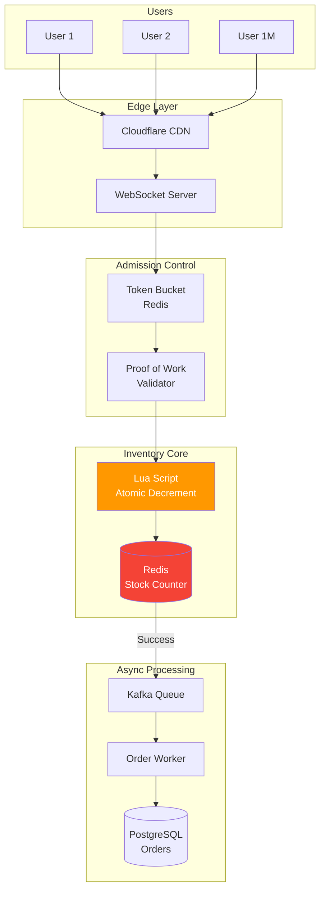
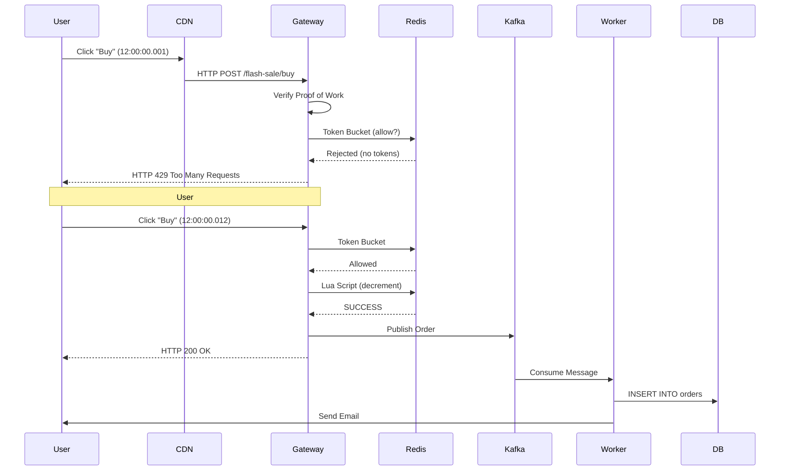

# Flash Sale Implementation Guide ("The 11.11 Problem")

## Problem Statement

**Scenario:** "11.11" Flash Sale
- **Product**: iPhone 15 Pro (10 units available)
- **Price**: $1 (99% off)
- **Start Time**: Exactly 12:00:00 PM
- **Expected Traffic**: 1,000,000 concurrent users clicking "Buy" simultaneously

**Requirements:**
1. **No Overselling**: Sell exactly 10 units, never 11
2. **No Crash**: System must handle 1M requests without going down
3. **Fair**: First-come, first-served (within milliseconds)
4. **Fast**: Response time < 100ms
5. **No Bots**: Prevent automated scripts from buying all stock

---

## Architecture



---

## Phase 1: Countdown & Admission Control

### WebSocket Countdown (Pre-Sale)

**Purpose:** Keep users engaged, synchronize exact start time

**Implementation:**
```go
type CountdownService struct {
    hub      *websocket.Hub
    saleTime time.Time
}

func (s *CountdownService) Broadcast() {
    ticker := time.NewTicker(1 * time.Second)
    
    for range ticker.C {
        remaining := time.Until(s.saleTime)
        
        message := CountdownMessage{
            SecondsRemaining: int(remaining.Seconds()),
            StartTime:        s.saleTime,
        }
        
        // Broadcast to 1M connected users
        s.hub.Broadcast(message)
        
        if remaining <= 0 {
            s.hub.Broadcast(FlashSaleStartMessage{})
            break
        }
    }
}
```

**Frontend:**
```typescript
const ws = new WebSocket('wss://titan.com/flash-sale/countdown');

ws.onmessage = (event) => {
  const data = JSON.parse(event.data);
  
  if (data.type === 'countdown') {
    updateCountdown(data.secondsRemaining);
  }
  
  if (data.type === 'flash_sale_start') {
    enableBuyButton();  // Button becomes clickable
  }
};
```

### Token Bucket Rate Limiting

**Problem:** 1M requests hit at exactly 12:00:00

**Solution:** Allow only 100 requests through using Token Bucket

**Redis Implementation:**
```lua
-- rate_limit.lua
local key = KEYS[1]           -- "flash_sale:iphone15:tokens"
local max_tokens = tonumber(ARGV[1])  -- 100
local refill_rate = tonumber(ARGV[2]) -- 10 tokens/sec

local current = redis.call('GET', key)
if not current then
    current = max_tokens
end

current = tonumber(current)

if current > 0 then
    redis.call('DECR', key)
    return 1  -- Allowed
else
    return 0  -- Rejected
end
```

**Go Wrapper:**
```go
func (g *Gateway) AllowRequest(productID string) bool {
    script := redis.NewScript(rateLimitScript)
    
    result, _ := script.Run(ctx, g.redis,
        []string{fmt.Sprintf("flash_sale:%s:tokens", productID)},
        100,  // max tokens
        10,   // refill rate
    ).Int()
    
    return result == 1
}
```

**Result:**
- 1,000,000 requests arrive
- 999,900 get HTTP 429 (Too Many Requests) instantly
- 100 proceed to inventory check

### Proof of Work (Bot Prevention)

**Challenge:** Client must solve computational puzzle

**Backend:**
```go
type Challenge struct {
    Nonce      string
    Difficulty int
    Timestamp  time.Time
}

func (s *FlashSaleService) GenerateChallenge() Challenge {
    return Challenge{
        Nonce:      randomString(32),
        Difficulty: 4,  // Must find hash with 4 leading zeros
        Timestamp:  time.Now(),
    }
}

func (s *FlashSaleService) VerifyProof(challenge Challenge, solution string) bool {
    // Verify solution
    hash := sha256.Sum256([]byte(challenge.Nonce + solution))
    prefix := strings.Repeat("0", challenge.Difficulty)
    
    if !strings.HasPrefix(hex.EncodeToString(hash[:]), prefix) {
        return false
    }
    
    // Verify not expired (10 sec window)
    if time.Since(challenge.Timestamp) > 10*time.Second {
        return false
    }
    
    return true
}
```

**Frontend (Web Worker):**
```javascript
// flash-sale-worker.js
self.onmessage = (e) => {
  const { nonce, difficulty } = e.data;
  
  let solution = 0;
  while (true) {
    const hash = sha256(nonce + solution);
    
    if (hash.startsWith('0'.repeat(difficulty))) {
      self.postMessage({ solution });
      break;
    }
    
    solution++;
  }
};
```

**Impact:**
- Automated bots slow down (must compute hash)
- Humans barely notice (< 100ms computation)
- Distributed API-level bots get rate-limited

---

## Phase 2: Atomic Inventory Decrement

### The Core: Redis Lua Script

**Why Lua?**
- Executes atomically (no race conditions)
- Sub-millisecond performance
- Runs inside Redis (network overhead eliminated)

**inventory_decrement.lua:**
```lua
-- KEYS[1] = "stock:product:iphone15"
-- KEYS[2] = "buyers:product:iphone15"
-- ARGV[1] = user_id

local stock_key = KEYS[1]
local buyers_set = KEYS[2]
local user_id = ARGV[1]

-- Check if user already purchased (prevent double-buy)
if redis.call('SISMEMBER', buyers_set, user_id) == 1 then
    return 'ALREADY_PURCHASED'
end

-- Get current stock
local stock = redis.call('GET', stock_key)
if not stock then
    return 'INVALID_PRODUCT'
end

stock = tonumber(stock)

-- Check stock availability
if stock <= 0 then
    return 'OUT_OF_STOCK'
end

-- Decrement stock atomically
redis.call('DECR', stock_key)

-- Mark user as buyer
redis.call('SADD', buyers_set, user_id)

-- Set expiration (prevent memory leak)
redis.call('EXPIRE', buyers_set, 86400)  -- 24 hours

return 'SUCCESS'
```

**Go Service:**
```go
type InventoryService struct {
    redis  *redis.Client
    script *redis.Script
}

func NewInventoryService(r *redis.Client) *InventoryService {
    return &InventoryService{
        redis:  r,
        script: redis.NewScript(luaScript),
    }
}

func (s *InventoryService) DecrementStock(productID, userID string) (string, error) {
    result, err := s.script.Run(
        context.Background(),
        s.redis,
        []string{
            fmt.Sprintf("stock:product:%s", productID),
            fmt.Sprintf("buyers:product:%s", productID),
        },
        userID,
    ).Result()
    
    if err != nil {
        return "", err
    }
    
    return result.(string), nil
}
```

**Performance:**
```
Latency: < 1ms (p99)
Throughput: 100,000 ops/sec per Redis node
```

---

## Phase 3: Async Order Processing

### Queue-Based Load Leveling

**Problem:** Writing to SQL immediately would overwhelm database

**Solution:** Kafka queue buffers requests

**Flow:**
```
Redis Says "SUCCESS" → Publish to Kafka → Worker Consumes → Write to PostgreSQL
```

**Producer (Inventory Service):**
```go
func (s *InventoryService) DecrementStock(productID, userID string) error {
    result, _ := s.executeRedisScript(productID, userID)
    
    if result != "SUCCESS" {
        return fmt.Errorf("stock unavailable: %s", result)
    }
    
    // Publish to Kafka (async, don't wait)
    s.kafka.Publish("flash_sale.orders", OrderMessage{
        ProductID: productID,
        UserID:    userID,
        Timestamp: time.Now(),
    })
    
    return nil
}
```

**Consumer (Order Worker):**
```go
func (w *OrderWorker) ProcessOrders() {
    consumer := kafka.NewConsumer("order-worker-group")
    
    for msg := range consumer.Messages("flash_sale.orders") {
        order := deserialize(msg.Value)
        
        // Write to PostgreSQL (slow, but buffered by Kafka)
        w.db.Exec(`
            INSERT INTO orders (id, user_id, product_id, status, created_at)
            VALUES ($1, $2, $3, 'PENDING', $4)
        `, uuid.New(), order.UserID, order.ProductID, order.Timestamp)
        
        // Send confirmation email (async)
        w.emailService.Send(order.UserID, "Order confirmed!")
        
        consumer.Commit(msg.Offset)
    }
}
```

**Benefits:**
- **Decoupling**: Redis success ≠ DB write success
- **Backpressure**: Kafka buffers millions of messages
- **Retry**: If DB write fails, Kafka replays message

---

## Phase 4: Cache Warming

### Pre-Load Data Before Sale

**Problem:** First requests cause cache misses, slow down system

**Solution:** Warm cache 30 minutes before sale

**Warming Script:**
```go
func (s *FlashSaleService) WarmCache(productID string) {
    // 1. Load product details from DB
    product := s.db.GetProduct(productID)
    
    // 2. Cache in Redis
    s.redis.Set(ctx, fmt.Sprintf("product:%s", productID), product, 1*time.Hour)
    
    // 3. Initialize stock counter
    s.redis.Set(ctx, fmt.Sprintf("stock:product:%s", productID), product.Stock, 1*time.Hour)
    
    // 4. Initialize buyer set
    s.redis.Del(ctx, fmt.Sprintf("buyers:product:%s", productID))
    
    log.Printf("Cache warmed for product %s (stock: %d)", productID, product.Stock)
}
```

**Scheduled Job:**
```go
func ScheduleFlashSale(productID string, startTime time.Time) {
    // Warm cache 30 min before
    warmTime := startTime.Add(-30 * time.Minute)
    
    scheduler.At(warmTime, func() {
        WarmCache(productID)
    })
    
    // Start flash sale
    scheduler.At(startTime, func() {
        EnableFlashSale(productID)
    })
}
```

---

## Phase 5: Frontend Optimization

### Optimistic UI Updates

**User Experience:**
```
User clicks "Buy"
→ Button immediately shows "Processing..." (optimistic)
→ Backend responds (100ms later)
→ If success: "Order Confirmed!"
→ If fail: "Out of Stock" (rollback UI)
```

**React Implementation:**
```typescript
const [status, setStatus] = useState<'idle' | 'processing' | 'success' | 'failed'>('idle');

const handleBuyClick = async () => {
  // Optimistic update
  setStatus('processing');
  
  try {
    const response = await fetch('/api/flash-sale/buy', {
      method: 'POST',
      body: JSON.stringify({ productId: 'iphone15' })
    });
    
    if (response.ok) {
      setStatus('success');
      showConfetti();
    } else {
      const error = await response.json();
      setStatus('failed');
      showError(error.message);
    }
  } catch {
    setStatus('failed');
    showError('Network error');
  }
};
```

### Client-Side Throttling

**Prevent users from spamming "Buy" button:**

```typescript
const { mutate, isLoading } = useMutation({
  mutationFn: buyProduct,
  onSuccess: () => toast.success('Order placed!'),
  onError: () => toast.error('Failed'),
});

return (
  <button
    onClick={() => mutate()}
    disabled={isLoading}  // Gray out while processing
  >
    {isLoading ? 'Processing...' : 'Buy Now'}
  </button>
);
```

---

## Complete Request Flow



**Timeline:**
- **T+0ms**: 1,000,000 requests arrive
- **T+5ms**: Token bucket rejects 999,900 requests
- **T+10ms**: 100 requests check inventory (Redis Lua)
- **T+12ms**: 10 requests succeed, 90 get "Out of Stock"
- **T+15ms**: 10 success responses returned to users
- **T+100ms**: Kafka messages consumed
- **T+500ms**: Orders written to PostgreSQL
- **T+2s**: Confirmation emails sent

---

## Data Consistency

### Redis → PostgreSQL Sync

**Problem:** What if Kafka fails? Redis says "sold" but order not in DB

**Solution: Reconciliation Job**

```go
func ReconcileOrders() {
    // Get all buyers from Redis
    productID := "iphone15"
    buyers := redis.SMembers(ctx, fmt.Sprintf("buyers:product:%s", productID))
    
    for _, userID := range buyers {
        // Check if order exists in DB
        exists := db.Exists("SELECT 1 FROM orders WHERE user_id = $1 AND product_id = $2", userID, productID)
        
        if !exists {
            log.Warnf("Order missing for user %s, creating...", userID)
            
            // Create order manually
            db.Exec(`
                INSERT INTO orders (id, user_id, product_id, status)
                VALUES ($1, $2, $3, 'PENDING')
            `, uuid.New(), userID, productID)
        }
    }
}
```

**Run every 5 minutes during flash sale**

---

## Monitoring & Alerts

### Key Metrics

```yaml
# Prometheus Metrics
- flash_sale_requests_total{status="success|failed|rate_limited"}
- flash_sale_stock_remaining
- flash_sale_processing_duration_seconds
- kafka_flash_sale_lag
```

### Dashboards

**Grafana: Flash Sale Dashboard**
```
┌─────────────────────────────────────────────────┐
│ Stock Remaining: [====>       ] 3/10            │
├─────────────────────────────────────────────────┤
│ Requests/sec: [GRAPH] Peak: 1.2M               │
├─────────────────────────────────────────────────┤
│ Success Rate: 0.001% (10/1,000,000)            │
├─────────────────────────────────────────────────┤
│ Latency p99: 8ms                                │
└─────────────────────────────────────────────────┘
```

### Alerts

```yaml
groups:
- name: flash-sale-alerts
  rules:
  - alert: StockMismatch
    expr: abs(redis_stock - postgres_stock) > 5
    for: 1m
    annotations:
      summary: "Stock desync between Redis and DB"
      
  - alert: HighLatency
    expr: histogram_quantile(0.99, flash_sale_processing_duration_seconds) > 0.1
    annotations:
      summary: "Flash sale p99 latency > 100ms"
```

---

## Load Testing

### Simulation with k6

```javascript
// flash-sale-test.js
import http from 'k6/http';
import { check } from 'k6';

export let options = {
  stages: [
    { duration: '5s', target: 10000 },      // Ramp up
    { duration: '10s', target: 1000000 },   // Peak load
    { duration: '5s', target: 0 },          // Ramp down
  ],
};

export default function () {
  const payload = JSON.stringify({
    product_id: 'iphone15',
    user_id: `user-${__VU}`,  // Virtual User ID
  });
  
  const res = http.post('https://titan.com/api/flash-sale/buy', payload, {
    headers: { 'Content-Type': 'application/json' },
  });
  
  check(res, {
    'status is 200 or 429': (r) => r.status === 200 || r.status === 429,
    'latency < 100ms': (r) => r.timings.duration < 100,
  });
}
```

**Run:**
```bash
k6 run --vus 1000000 --duration 30s flash-sale-test.js
```

---

## Cost Analysis

### Infrastructure for 1M Concurrent Users

| Component | Specs | Count | Cost/month |
|-----------|-------|-------|------------|
| Redis (r6g.4xlarge) | 16 vCPU, 128 GB | 10 | $3,500 |
| API Gateway (c6g.2xlarge) | 8 vCPU, 16 GB | 50 | $12,000 |
| Kafka (m5.xlarge) | 4 vCPU, 16 GB | 5 | $750 |
| PostgreSQL (db.r5.2xlarge) | 8 vCPU, 64 GB | 3 | $3,600 |
| **Total** | | | **$19,850/month** |

**Per-Sale Cost:** $19,850 / 30 days / 24 hours = **$28/hour**

**For a 10-minute flash sale:** $4.67

---

## Summary

**Flash Sale Architecture:**

✅ **Admission Control**: Token bucket filters 99.99% of traffic  
✅ **Atomic Operations**: Redis Lua prevents race conditions  
✅ **Queue Buffering**: Kafka decouples fast path from slow path  
✅ **Bot Prevention**: Proof of Work slows automated scripts  
✅ **Monitoring**: Real-time dashboards for stock/latency  

**Performance:**
- **Throughput**: 1M requests/sec (edge layer)
- **Latency**: < 10ms (p99)
- **Accuracy**: 100% (no overselling)

**When to Use:**
- Limited inventory + massive demand
- E-commerce flash sales (Black Friday, 11.11)
- Ticket sales (concerts, sports)
- Limited-edition product drops

---

**Document Version:** 1.0  
**Last Updated:** 2025-12-04
