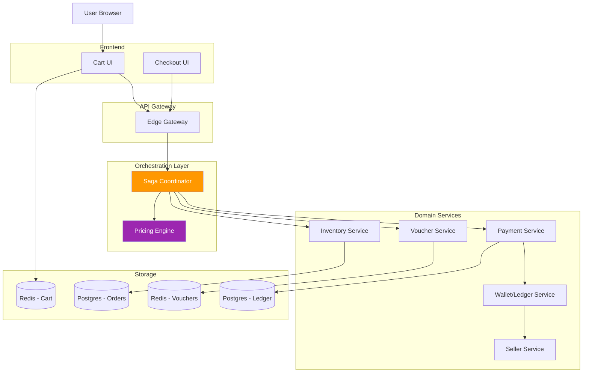

# Multi-Vendor Checkout Orchestrator

## Distributed Transactions & Complex Payment Splitting

**Challenge**: Handle a cart with items from multiple sellers, apply various discounts, split payments correctly, and ensure atomicity across distributed services.

---

## 🎯 Problem Statement

### The Complexity

**Scenario**: User's shopping cart contains:
- **Item A** from Seller X: $10 (electronics)
- **Item B** from Seller Y: $20 (clothing)
- **Item C** from Seller Z: $50 (books)

**User applies**:
- Platform voucher: "10% off total"
- Seller X voucher: "$2 off electronics"
- Free shipping voucher

**Requirements**:
1. Calculate correct totals for each seller  
2. Apply discounts in proper order
3. Reserve inventory atomically
4. Lock vouchers (prevent double-use)
5. Charge customer once
6. Split payment to 3 sellers
7. Hold funds in escrow until delivery confirmed
8. Handle failures gracefully (rollback)

**The "11.11" Twist**: This must work when:
- 1M users checking out simultaneously
- Inventory changing every millisecond (flash sales)
- Network partitions between services
- Vouchers being used concurrently

---

## 🏗️ Architecture Overview



---

## 📦 Core Components

### 1. Cart Service

**Purpose**: Fast, temporary storage for user selections

**Technology**: Redis (Key-Value)

**Schema**:
```json
{
  "cart:user:12345": {
    "user_id": "12345",
    "items": [
      {
        "item_id": "prod_001",
        "seller_id": "seller_x",
        "product_name": "iPhone 15",
        "quantity": 1,
        "price": 999.00,
        "category": "electronics"
      },
      {
        "item_id": "prod_002",
        "seller_id": "seller_y",
        "product_name": "T-Shirt",
        "quantity": 2,
        "price": 15.00,
        "category": "clothing"
      }
    ],
    "vouchers": ["VOUCHER10", "FREESHIP"],
    "updated_at": "2025-01-01T10:00:00Z",
    "ttl": 86400
  }
}
```

**Operations**:
```go
// Add item to cart
func (c *CartService) AddItem(userID string, item CartItem) error {
    key := fmt.Sprintf("cart:user:%s", userID)
    
    cart, err := c.redis.Get(ctx, key).Result()
    if err == redis.Nil {
        // Create new cart
        cart = NewCart(userID)
    }
    
    cart.Items = append(cart.Items, item)
    
    json, _ := json.Marshal(cart)
    return c.redis.Set(ctx, key, json, 24*time.Hour).Err()
}

// Apply voucher
func (c *CartService) ApplyVoucher(userID, voucherCode string) error {
    // Validate voucher first
    valid, err := c.voucherSvc.ValidateVoucher(voucherCode, userID)
    if !valid {
        return ErrInvalidVoucher
    }
    
    key := fmt.Sprintf("cart:user:%s", userID)
    cart, _ := c.getCart(userID)
    
    // Prevent duplicate vouchers
    for _, v := range cart.Vouchers {
        if v == voucherCode {
            return ErrVoucherAlreadyApplied
        }
    }
    
    cart.Vouchers = append(cart.Vouchers, voucherCode)
    return c.saveCart(cart)
}
```

**Performance**:
- Add to cart: < 5ms
- Get cart: < 2ms
- TTL: 24 hours (auto-cleanup)

---

### 2. Pricing Engine (The Calculator)

**Purpose**: Apply complex discount rules in correct order

**Pattern**: Chain of Responsibility

**Discount Priority**:
1. Item-level discounts (seller promo)
2. Category discounts
3. Platform vouchers
4. Shipping vouchers
5. Loyalty points

**Implementation**:
```go
type PricingRule interface {
    Apply(cart *Cart) (*PriceBreakdown, error)
}

// Rule 1: Item discounts
type ItemDiscountRule struct{}

func (r *ItemDiscountRule) Apply(cart *Cart) (*PriceBreakdown, error) {
    breakdown := &PriceBreakdown{}
    
    for _, item := range cart.Items {
        originalPrice := item.Price * float64(item.Quantity)
        
        // Check if seller has discount on this item
        discount, err := r.getSellerDiscount(item.SellerID, item.ProductID)
        if err == nil && discount.Active {
            discountedPrice := originalPrice * (100 - discount.Percentage) / 100
            breakdown.AddDiscount(fmt.Sprintf("Seller discount (%d%%)", discount.Percentage), originalPrice - discountedPrice)
            originalPrice = discountedPrice
        }
        
        breakdown.AddSubtotal(item.SellerID, originalPrice)
    }
    
    return breakdown, nil
}

// Rule 2: Platform vouchers
type PlatformVoucherRule struct {
    voucherSvc *VoucherService
}

func (r *PlatformVoucherRule) Apply(cart *Cart) (*PriceBreakdown, error) {
    breakdown := cart.CurrentBreakdown
    
    for _, voucherCode := range cart.Vouchers {
        voucher, err := r.voucherSvc.GetVoucher(voucherCode)
        if err != nil {
            continue
        }
        
        if voucher.Type == "PERCENTAGE" {
            discount := breakdown.GrandTotal * voucher.Value / 100
            
            // Cap at max discount
            if discount > voucher.MaxDiscount {
                discount = voucher.MaxDiscount
            }
            
            breakdown.AddDiscount(fmt.Sprintf("Voucher: %s", voucher.Code), discount)
            breakdown.GrandTotal -= discount
        } else if voucher.Type == "FIXED" {
            breakdown.AddDiscount(fmt.Sprintf("Voucher: %s", voucher.Code), voucher.Value)
            breakdown.GrandTotal -= voucher.Value
        }
    }
    
    return breakdown, nil
}

// Pricing Engine orchestrates all rules
type PricingEngine struct {
    rules []PricingRule
}

func NewPricingEngine() *PricingEngine {
    return &PricingEngine{
        rules: []PricingRule{
            &ItemDiscountRule{},
            &CategoryDiscountRule{},
            &PlatformVoucherRule{},
            &ShippingRule{},
            &TaxRule{},
        },
    }
}

func (e *PricingEngine) Calculate(cart *Cart) (*PriceBreakdown, error) {
    breakdown := &PriceBreakdown{
        Items: make(map[string]float64),
        Discounts: make([]Discount, 0),
    }
    
    // Apply each rule in sequence
    for _, rule := range e.rules {
        updatedBreakdown, err := rule.Apply(cart)
        if err != nil {
            return nil, err
        }
        breakdown = updatedBreakdown
    }
    
    return breakdown, nil
}
```

**Example Output**:
```json
{
  "breakdown": {
    "items": {
      "seller_x": 998.00,
      "seller_y": 30.00,
      "seller_z": 50.00
    },
    "subtotal": 1078.00,
    "discounts": [
      {
        "name": "Seller X promo (-$2)",
        "amount": 2.00
      },
      {
        "name": "Platform voucher (10%)",
        "amount": 107.80
      },
      {
        "name": "Free shipping",
        "amount": 15.00
      }
    ],
    "total_discount": 124.80,
    "tax": 95.32,
    "shipping": 0.00,
    "grand_total": 1048.52,
    "seller_splits": {
      "seller_x": 897.20,
      "seller_y": 26.10,
      "seller_z": 43.50,
      "platform_fee": 81.72
    }
  }
}
```

---

### 3. Saga Coordinator (Orchestration Pattern)

**Purpose**: Coordinate distributed transaction across multiple services

**Pattern**: Orchestration Saga (vs. Choreography)

**Why Orchestration?**
- ✅ Centralized error handling
- ✅ Easy to visualize flow
- ✅ Simpler debugging
- ✅ Clear ownership

**Saga Workflow**:
```
1. CreateOrder (Pending)
2. ReserveInventory (for each seller)
3. LockVouchers
4. ChargePayment
5. SplitPayment (to sellers)
6. ConfirmOrder
```

**If any step fails → Execute compensations in reverse order**

**Implementation**:
```go
type CheckoutSaga struct {
    orderID         string
    userID          string
    cart            *Cart
    priceBreakdown  *PriceBreakdown
    state           SagaState
    compensations   []CompensationFunc
    
    // Services
    orderSvc       *OrderService
    inventorySvc   *InventoryService
    voucherSvc     *VoucherService
    paymentSvc     *PaymentService
    walletSvc      *WalletService
}

type SagaState string

const (
    StateInit           SagaState = "INIT"
    StateOrderCreated   SagaState = "ORDER_CREATED"
    StateInventoryReserved SagaState = "INVENTORY_RESERVED"
    StateVouchersLocked SagaState = "VOUCHERS_LOCKED"
    StatePaymentCharged SagaState = "PAYMENT_CHARGED"
    StatePaymentSplit   SagaState = "PAYMENT_SPLIT"
    StateCompleted      SagaState = "COMPLETED"
    StateFailed         SagaState = "FAILED"
)

func (s *CheckoutSaga) Execute() error {
    // Step 1: Create order record
    if err := s.createOrder(); err != nil {
        return s.rollback(err)
    }
    s.state = StateOrderCreated
    
    // Step 2: Reserve inventory for all items
    if err := s.reserveInventory(); err != nil {
        return s.rollback(err)
    }
    s.state = StateInventoryReserved
    s.compensations = append(s.compensations, s.releaseInventory)
    
    // Step 3: Lock vouchers
    if err := s.lockVouchers(); err != nil {
        return s.rollback(err)
    }
    s.state = StateVouchersLocked
    s.compensations = append(s.compensations, s.unlockVouchers)
    
    // Step 4: Charge payment
    if err := s.chargePayment(); err != nil {
        return s.rollback(err)
    }
    s.state = StatePaymentCharged
    s.compensations = append(s.compensations, s.refundPayment)
    
    // Step 5: Split payment to sellers
    if err := s.splitPayment(); err != nil {
        return s.rollback(err)
    }
    s.state = StatePaymentSplit
    
    // Step 6: Confirm order
    if err := s.confirmOrder(); err != nil {
        return s.rollback(err)
    }
    s.state = StateCompleted
    
    return nil
}

func (s *CheckoutSaga) reserveInventory() error {
    // Group items by seller
    itemsBySeller := s.groupItemsBySeller()
    
    for sellerID, items := range itemsBySeller {
        req := &inventory.ReserveRequest{
            OrderID:  s.orderID,
            SellerID: sellerID,
            Items:    items,
        }
        
        resp, err := s.inventorySvc.Reserve(context.Background(), req)
        if err != nil {
            return fmt.Errorf("inventory reserve failed for seller %s: %w", sellerID, err)
        }
        
        if !resp.Success {
            return fmt.Errorf("insufficient stock: %s", resp.Message)
        }
    }
    
    return nil
}

func (s *CheckoutSaga) lockVouchers() error {
    for _, voucherCode := range s.cart.Vouchers {
        req := &voucher.LockRequest{
            VoucherCode: voucherCode,
            UserID:      s.userID,
            OrderID:     s.orderID,
        }
        
        resp, err := s.voucherSvc.Lock(context.Background(), req)
        if err != nil || !resp.Success {
            return fmt.Errorf("voucher lock failed: %s", voucherCode)
        }
    }
    
    return nil
}

func (s *CheckoutSaga) chargePayment() error {
    req := &payment.ChargeRequest{
        Amount:        s.priceBreakdown.GrandTotal,
        UserID:        s.userID,
        OrderID:       s.orderID,
        IdempotencyKey: fmt.Sprintf("order-%s", s.orderID),
    }
    
    resp, err := s.paymentSvc.Charge(context.Background(), req)
    if err != nil {
        return fmt.Errorf("payment charge failed: %w", err)
    }
    
    if !resp.Success {
        return fmt.Errorf("payment declined: %s", resp.ErrorMessage)
    }
    
    return nil
}

func (s *CheckoutSaga) splitPayment() error {
    // Hold in platform escrow first
    escrowReq := &wallet.EscrowRequest{
        OrderID: s.orderID,
        Amount:  s.priceBreakdown.GrandTotal,
        Splits:  s.priceBreakdown.SellerSplits,
    }
    
    resp, err := s.walletSvc.CreateEscrow(context.Background(), escrowReq)
    if err != nil {
        return fmt.Errof("escrow creation failed: %w", err)
    }
    
    // Splits will be released when user confirms delivery
    return nil
}

func (s *CheckoutSaga) rollback(originalErr error) error {
    log.Errorf("Saga failed at state %s: %v. Rolling back...", s.state, originalErr)
    
    // Execute compensations in reverse order
    for i := len(s.compensations) - 1; i >= 0; i-- {
        compensation := s.compensations[i]
        if err := compensation(); err != nil {
            log.Errorf("Compensation failed: %v", err)
            // Continue trying other compensations
        }
    }
    
    // Mark order as failed
    s.orderSvc.UpdateStatus(s.orderID, "FAILED")
    
    s.state = StateFailed
    return fmt.Errorf("checkout failed: %w", originalErr)
}

// Compensation functions
func (s *CheckoutSaga) releaseInventory() error {
    for _, item := range s.cart.Items {
        s.inventorySvc.Release(item.SellerID, item.ProductID, item.Quantity, s.orderID)
    }
    return nil
}

func (s *CheckoutSaga) unlockVouchers() error {
    for _, voucherCode := range s.cart.Vouchers {
        s.voucherSvc.Unlock(voucherCode, s.userID, s.orderID)
    }
    return nil
}

func (s *CheckoutSaga) refundPayment() error {
    return s.paymentSvc.Refund(s.orderID)
}
```

---

### 4. Idempotency & Distributed Locking

#### Idempotency Keys

**Problem**: User clicks "Pay" twice → Charged twice ❌

**Solution**: Idempotency keys

```go
type PaymentService struct {
    db    *sql.DB
    redis *redis.Client
}

func (p *PaymentService) Charge(ctx context.Context, req *ChargeRequest) (*ChargeResponse, error) {
    // Check if already processed
    key := fmt.Sprintf("idempotency:%s", req.IdempotencyKey)
    
    // Try to set key (NX = only if not exists)
    success, err := p.redis.SetNX(ctx, key, "processing", 10*time.Minute).Result()
    if err != nil {
        return nil, err
    }
    
    if !success {
        // Already processing or completed
        cachedResult, _ := p.redis.Get(ctx, key).Result()
        if cachedResult != "processing" {
            // Return cached result
            var response ChargeResponse
            json.Unmarshal([]byte(cachedResult), &response)
            return &response, nil
        }
        
        // Wait for other request to finish
        return nil, ErrConcurrentRequest
    }
    
    // Process payment
    response, err := p.processPayment(req)
    
    // Cache result for 24 hours
    jsonResp, _ := json.Marshal(response)
    p.redis.Set(ctx, key, jsonResp, 24*time.Hour)
    
    return response, err
}
```

#### Distributed Locking (Redlock)

**Problem**: User uses same voucher on two devices simultaneously

**Solution**: Distributed lock before applying voucher

```go
import "github.com/go-redsync/redsync/v4"

func (v *VoucherService) Lock(voucherCode, userID, orderID string) error {
    mutex := v.redlock.NewMutex(
        fmt.Sprintf("voucher:lock:%s:%s", voucherCode, userID),
        redsync.WithExpiry(30*time.Second),
        redsync.WithTries(3),
    )
    
    // Acquire lock
    if err := mutex.Lock(); err != nil {
        return ErrVoucherAlreadyInUse
    }
    defer mutex.Unlock()
    
    // Check if voucher already used
    used, err := v.isVoucherUsed(voucherCode, userID)
    if used {
        return ErrVoucherAlreadyUsed
    }
    
    // Mark as used
    return v.markVoucherUsed(voucherCode, userID, orderID)
}
```

---

### 5. Wallet/Ledger Service (Escrow)

**Purpose**: Hold funds until delivery confirmed ("Shopee Guarantee")

**Workflow**:
```
1. Payment charged → Held in platform wallet
2. Order shipped → Still in escrow
3. User clicks "Confirm Receipt" → Release to sellers
4. Timeout (7 days) → Auto-release
5. Refund requested → Return to user
```

**Schema**:
```sql
CREATE TABLE escrow_accounts (
    id UUID PRIMARY KEY,
    order_id UUID NOT NULL,
    total_amount DECIMAL(10,2) NOT NULL,
    status VARCHAR(20) NOT NULL, -- HELD, RELEASED, REFUNDED
    created_at TIMESTAMPTZ DEFAULT NOW(),
    released_at TIMESTAMPTZ
);

CREATE TABLE escrow_splits (
    id UUID PRIMARY KEY,
    escrow_id UUID REFERENCES escrow_accounts(id),
    seller_id UUID NOT NULL,
    amount DECIMAL(10,2) NOT NULL,
    status VARCHAR(20) NOT NULL,
    released_at TIMESTAMPTZ
);
```

**Implementation**:
```go
func (w *WalletService) CreateEscrow(orderID string, splits map[string]float64) error {
    tx, _ := w.db.Begin()
    
    // Create escrow account
    escrowID := uuid.New()
    totalAmount := 0.0
    for _, amount := range splits {
        totalAmount += amount
    }
    
    _, err := tx.Exec(`
        INSERT INTO escrow_accounts (id, order_id, totalamount, status)
        VALUES ($1, $2, $3, 'HELD')
    `, escrowID, orderID, totalAmount)
    
    if err != nil {
        tx.Rollback()
        return err
    }
    
    // Create splits
    for sellerID, amount := range splits {
        _, err := tx.Exec(`
            INSERT INTO escrow_splits (id, escrow_id, seller_id, amount, status)
            VALUES ($1, $2, $3, $4, 'HELD')
        `, uuid.New(), escrowID, sellerID, amount)
        
        if err != nil {
            tx.Rollback()
            return err
        }
    }
    
    return tx.Commit()
}

func (w *WalletService) ReleaseEscrow(orderID string) error {
    // Release funds to all sellers
    tx, _ := w.db.Begin()
    
    // Get escrow
    var escrowID string
    tx.QueryRow(`
        SELECT id FROM escrow_accounts 
        WHERE order_id = $1 AND status = 'HELD'
    `, orderID).Scan(&escrowID)
    
    // Get all splits
    rows, _ := tx.Query(`
        SELECT seller_id, amount FROM escrow_splits
        WHERE escrow_id = $1 AND status = 'HELD'
    `, escrowID)
    
    for rows.Next() {
        var sellerID string
        var amount float64
        rows.Scan(&sellerID, &amount)
        
        // Transfer to seller wallet
        w.transferToSeller(sellerID, amount)
    }
    
    // Update status
    tx.Exec(`UPDATE escrow_accounts SET status = 'RELEASED', released_at = NOW() WHERE id = $1`, escrowID)
    tx.Exec(`UPDATE escrow_splits SET status = 'RELEASED', released_at = NOW() WHERE escrow_id = $1`, escrowID)
    
    return tx.Commit()
}
```

---

## 🔥 Performance Optimization

### 1. Parallel Service Calls

```go
func (s *CheckoutSaga) reserveInventoryParallel() error {
    itemsBySeller := s.groupItemsBySeller()
    
    // Create error group
    g, ctx := errgroup.WithContext(context.Background())
    
    // Reserve inventory for all sellers in parallel
    for sellerID, items := range itemsBySeller {
        sellerID := sellerID // Capture variable
        items := items
        
        g.Go(func() error {
            req := &inventory.ReserveRequest{
                OrderID:  s.orderID,
                SellerID: sellerID,
                Items:    items,
            }
            
            resp, err := s.inventorySvc.Reserve(ctx, req)
            if err != nil || !resp.Success {
                return fmt.Errorf("inventory reserve failed for %s", sellerID)
            }
            return nil
        })
    }
    
    // Wait for all to complete
    return g.Wait()
}
```

**Performance**:
- Sequential: 3 sellers × 50ms = 150ms
- Parallel: max(50ms, 50ms, 50ms) = 50ms
- **3x faster**

### 2. Redis Pipeline for Voucher Validation

```go
func (v *VoucherService) ValidateMultiple(codes []string) (map[string]bool, error) {
    pipe := v.redis.Pipeline()
    
    // Queue all commands
    cmds := make(map[string]*redis.StringCmd)
    for _, code := range codes {
        key := fmt.Sprintf("voucher:%s", code)
        cmds[code] = pipe.Get(ctx, key)
    }
    
    // Execute pipeline
    _, err := pipe.Exec(ctx)
    if err != nil {
        return nil, err
    }
    
    // Collect results
    results := make(map[string]bool)
    for code, cmd := range cmds {
        val, err := cmd.Result()
        results[code] = (err == nil && val != "")
    }
    
    return results, nil
}
```

**Performance**:
- Without pipeline: 3 vouchers × 2ms = 6ms
- With pipeline: 1 roundtrip = 2ms
- **3x faster**

---

## 📊 Performance Targets

| Operation | Target | Measurement |
|-----------|--------|-------------|
| Cart add item | < 5ms | Redis SET |
| Price calculation | < 20ms | In-memory rules |
| Saga execution (success) | < 200ms | All steps |
| Saga execution (failure) | < 150ms | Early abort + compensation |
| Concurrent checkouts | 10,000/sec | Load test |
| Voucher lock (Redlock) | < 10ms | Distributed lock acquire |

---

## 🐛 Error Handling & Edge Cases

### Edge Case 1: Partial Inventory

**Scenario**: User orders 5 items, only 3 available

**Solution**:
```go
func (s *CheckoutSaga) reserveInventory() error {
    reserved := make(map[string]int)
    
    for _, item := range s.cart.Items {
        available, err := s.inventorySvc.CheckStock(item.ProductID)
        if err != nil {
            return err
        }
        
        if available < item.Quantity {
            // Partial fulfillment
            return &PartialStockError{
                ProductID: item.ProductID,
                Requested: item.Quantity,
               Available: available,
            }
        }
        
        // Reserve
        err = s.inventorySvc.Reserve(item.ProductID, item.Quantity, s.orderID)
        reserved[item.ProductID] = item.Quantity
    }
    
    return nil
}
```

**UX**: Show "Only 3 items available. Update quantity?" dialog

### Edge Case 2: Voucher Expired Mid-Checkout

**Solution**: Lock voucher at start, validate expiry

```go
func (v *VoucherService) Lock(code string) error {
    voucher, _ := v.getVoucher(code)
    
    // Check expiry
    if time.Now().After(voucher.ExpiresAt) {
        return ErrVoucherExpired
    }
    
    // Lock for 10 minutes
    key := fmt.Sprintf("voucher:lock:%s", code)
    return v.redis.Set(ctx, key, "locked", 10*time.Minute).Err()
}
```

### Edge Case 3: Payment Gateway Timeout

**Solution**: Async payment confirmation

```go
func (p *PaymentService) Charge(req *ChargeRequest) (*ChargeResponse, error) {
    // Start payment
    paymentID, err := p.stripeClient.CreatePaymentIntent(req)
    
    // Set timeout
    ctx, cancel := context.WithTimeout(context.Background(), 5*time.Second)
    defer cancel()
    
    // Wait for confirmation
    select {
    case result := <-p.waitForWebhook(paymentID):
        return result, nil
    case <-ctx.Done():
        // Timeout - Mark as pending
        p.markPaymentPending(paymentID, req.OrderID)
        return &ChargeResponse{Status: "PENDING"}, nil
    }
}

// Webhook handler
func (p *PaymentService) HandleWebhook(event StripeEvent) {
    if event.Type == "payment_intent.succeeded" {
        orderID := event.Metadata["order_id"]
        
        // Complete the saga
        p.sagaCoordinator.CompletePaymentStep(orderID)
    }
}
```

---

## 📈 Monitoring & Observability

### Key Metrics

```go
var (
    checkoutDuration = prometheus.NewHistogramVec(
        prometheus.HistogramOpts{
            Name: "checkout_duration_seconds",
            Help: "Checkout saga duration",
            Buckets: []float64{0.1, 0.2, 0.5, 1, 2, 5},
        },
        []string{"status"},
    )
    
    sagaCompensations = prometheus.NewCounter(
        prometheus.CounterOpts{
            Name: "saga_compensations_total",
            Help: "Total compensations executed",
        },
    )
    
    voucherLockFailures = prometheus.NewCounterVec(
        prometheus.CounterOpts{
            Name: "voucher_lock_failures_total",
            Help: "Voucher lock failures",
        },
        []string{"reason"},
    )
)
```

### Distributed Tracing

```go
func (s *CheckoutSaga) Execute() error {
    ctx, span := tracer.Start(context.Background(), "CheckoutSaga.Execute")
    defer span.End()
    
    span.SetAttributes(
        attribute.String("order_id", s.orderID),
        attribute.String("user_id", s.userID),
        attribute.Int("item_count", len(s.cart.Items)),
        attribute.Float64("total_amount", s.priceBreakdown.GrandTotal),
    )
    
    // Step 1
    _, step1Span := tracer.Start(ctx, "ReserveInventory")
    err := s.reserveInventory()
    step1Span.End()
    
    if err != nil {
        span.RecordError(err)
        return s.rollback(err)
    }
    
    // ...continue
}
```

**Jaeger View**:
```
CheckoutSaga.Execute (200ms)
├─ ReserveInventory (50ms)
│  ├─ InventoryService.Reserve [sellerX] (15ms)
│  ├─ InventoryService.Reserve [sellerY] (20ms)
│  └─ InventoryService.Reserve [sellerZ] (15ms)
├─ LockVouchers (30ms)
├─ ChargePayment (100ms)
│  └─ Stripe API Call (90ms)
└─ SplitPayment (20ms)
```

---

## 🔒 Security Considerations

### 1. Price Tampering Prevention

**Attack**: User modifies price in cart before checkout

**Defense**:
```go
func (s *CheckoutSaga) validatePrices() error {
    // Recalculate prices from source of truth
    freshPrices := s.pricing.CalculateFresh(s.cart)
    
    // Compare with submitted prices
    if math.Abs(freshPrices.GrandTotal - s.priceBreakdown.GrandTotal) > 0.01 {
        log.Warnf("Price tampering detected: expected %.2f, got %.2f", 
            freshPrices.GrandTotal, s.priceBreakdown.GrandTotal)
        return ErrPriceTampering
    }
    
    return nil
}
```

### 2. Voucher Abuse

**Attack**: Share voucher code with multiple accounts

**Defense**:
```go
func (v *VoucherService) Lock(code, userID string) error {
    // Check usage limit per user
    usageCount := v.getUserUsageCount(code, userID)
    if usageCount >= MAX_USES_PER_USER {
        return ErrVoucherLimitExceeded
    }
    
    // Check total usage
    totalUsage := v.getTotalUsage(code)
    if totalUsage >= voucher.MaxUses {
        return ErrVoucherExhausted
    }
    
    // Proceed with lock
    return v.lockVoucher(code, userID)
}
```

---

## 🧪 Testing Strategy

### Unit Tests

```go
func TestSagaRollback(t *testing.T) {
    saga := &CheckoutSaga{
        orderID: "test-order-1",
        state:   StateInventoryReserved,
        compensations: []CompensationFunc{
            func() error { return nil }, // inventory release
        },
    }
    
    // Simulate payment failure
    err := saga.chargePayment()
    assert.Error(t, err)
    
    // Verify rollback executed
    assert.Equal(t, StateFailed, saga.state)
    assert.Equal(t, 0, len(saga.compensations)) // All executed
}
```

### Integration Tests

```go
func TestE2ECheckout(t *testing.T) {
    // Setup
    user := createTestUser()
    cart := createTestCart(user.ID, 3) // 3 items
    voucher := createTestVoucher("TEST10", 10) // 10% off
    
    // Execute
    checkout := NewCheckoutController(services...)
    result, err := checkout.ProcessCheckout(user.ID, cart.ID, []string{voucher.Code})
    
    // Assert
    assert.NoError(t, err)
    assert.Equal(t, "COMPLETED", result.Status)
    
    // Verify inventory
    for _, item := range cart.Items {
        stock := inventorySvc.GetStock(item.ProductID)
        assert.Equal(t, item.OriginalStock - item.Quantity, stock)
    }
    
    // Verify voucher used
    voucherStatus := voucherSvc.GetStatus(voucher.Code)
    assert.True(t, voucherStatus.Used)
    
    // Verify escrow created
    escrow := walletSvc.GetEscrow(result.OrderID)
    assert.NotNil(t, escrow)
    assert.Equal(t, "HELD", escrow.Status)
}
```

---

## 📚 Summary

**Multi-Vendor Checkout Orchestrator provides**:

✅ **Atomic Operations**: All-or-nothing checkout guarantee  
✅ **Price Accuracy**: Complex discount calculations  
✅ **Fair Payment Split**: Correct seller attribution  
✅ **Buyer Protection**: Escrow until delivery confirmed  
✅ **High Performance**: <200ms checkout latency  
✅ **Fault Tolerance**: Automatic rollback on failures  

**Trade-offs**:

❌ **Complexity**: Saga pattern requires careful design  
❌ **Eventual Consistency**: Escrow release may lag  
❌ **Coordination Overhead**: Multiple service calls  

**When to Use**:
- Multi-vendor marketplaces
- Complex pricing rules
- Escrow/payment splitting required
- High transaction integrity needs

---

**Document Version:** 1.0  
**Last Updated:** 2025-12-04
