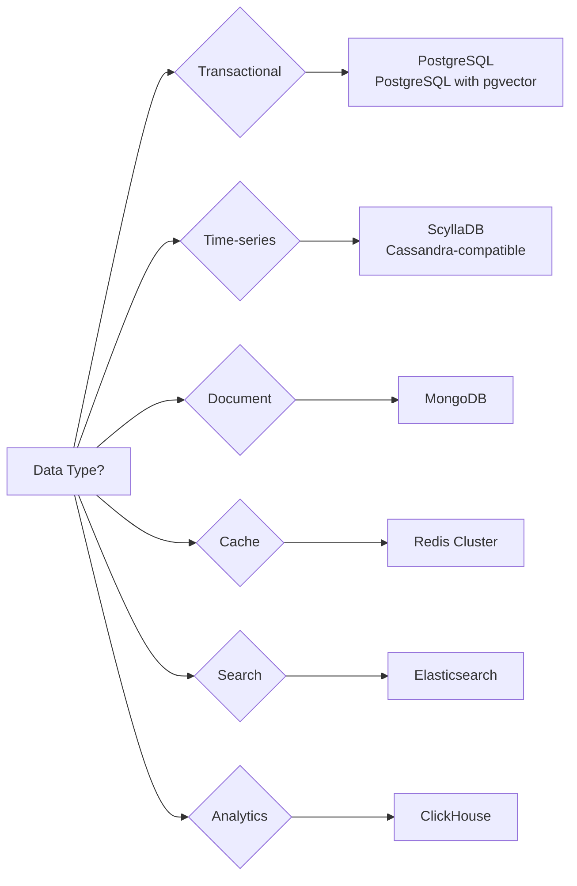
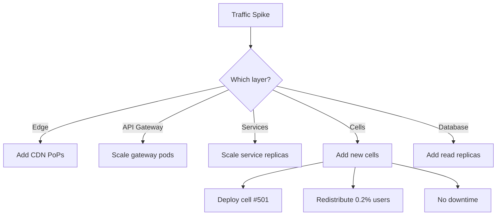
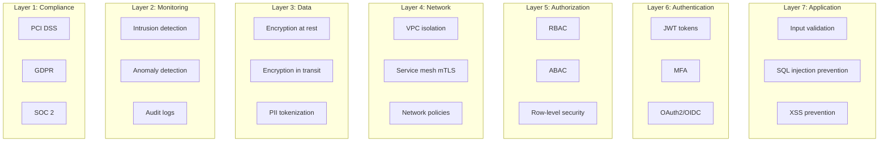
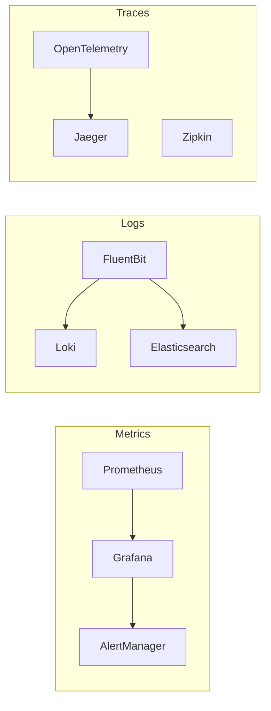
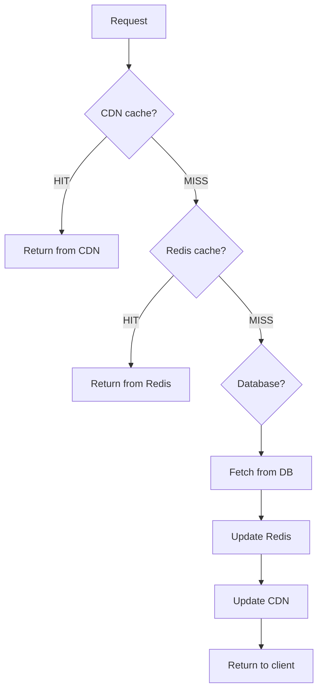

# Titan Commerce Platform - System Architecture Overview

## Executive Summary

Titan Commerce is a **hyperscale e-commerce platform** designed to handle **50M Daily Active Users (DAU)** and **200K Transactions Per Second (TPS)**, comparable to platforms like Shopee, Alibaba, and Amazon. The architecture leverages a **cell-based microservices approach** with **30+ services** deployed across **500 isolated cells**, totaling **45,000+ pods** in production.

### Key Metrics
- **Scale**: 50M DAU, 200K TPS, 100M+ products
- **Architecture**: 30+ microservices, 500 cells, 45K+ pods
- **Availability**: 99.99% uptime (52 minutes downtime/year)
- **Performance**: <100ms P99 latency, <50ms fraud detection
- **Data**: 200K events/sec, 10PB+ total storage

---

## Architecture Principles

### 1. **Cell-Based Isolation**
Instead of monolithic service clusters serving all users, we partition users into **500 isolated cells**, each containing a complete copy of all 30 microservices.

**Benefits**:
- **Fault isolation**: Cell failure impacts only 0.2% of users (10K/5M)
- **Linear scalability**: Add cells to scale horizontally
- **Independent deployment**: Deploy/rollback cells independently
- **Multi-region**: Deploy cells in different regions for global reach

### 2. **Event-Driven Architecture**
Services communicate primarily through **Kafka events** rather than synchronous RPC calls.

**Benefits**:
- **Decoupling**: Services don't need to know about each other
- **Resilience**: Event replay for recovery
- **Auditability**: Complete audit trail of all state changes
- **Scalability**: Asynchronous processing handles traffic spikes

### 3. **CQRS + Event Sourcing**
Separates **write** (commands) and **read** (queries) models with event sourcing for critical services.

**Benefits**:
- **Performance**: Optimized read/write data models
- **Consistency**: Events as source of truth
- **Time travel**: Replay events to any point in time
- **Analytics**: Event stream powers real-time analytics

### 4. **Domain-Driven Design (DDD)**
Services are organized around **business domains** rather than technical layers.

**Benefits**:
- **Clear boundaries**: Each service owns its domain
- **Team autonomy**: Teams own complete services
- **Maintainability**: Changes localized to domain boundaries

---

## System Architecture Diagram

```mermaid
graph TB
    subgraph "Edge Layer"
        CDN[CloudFlare CDN]
        LB[Global Load Balancer]
    end
    
    subgraph "API Gateway Layer"
        GW1[API Gateway - Region 1]
        GW2[API Gateway - Region 2]
    end
    
    subgraph "Cell Router Layer"
        CR[Cell Router<br/>Hash-based routing]
    end
    
    subgraph "Cell #1 - 10K users"
        C1_ORDER[Order Service]
        C1_PAYMENT[Payment Service]
        C1_CART[Cart Service]
        C1_PRODUCT[Product Service]
        C1_USER[User Service]
        C1_OTHER[... 25 more services]
    end
    
    subgraph "Cell #2 - 10K users"
        C2_ORDER[Order Service]
        C2_PAYMENT[Payment Service]
        C2_CART[Cart Service]
        C2_PRODUCT[Product Service]
        C2_USER[User Service]
        C2_OTHER[... 25 more services]
    end
    
    subgraph "Cell #N (500 total)"
        CN_SERVICES[30 Services × 3 replicas<br/>= 90 pods per cell]
    end
    
    subgraph "Data Layer"
        KAFKA[Kafka Cluster<br/>200K events/sec]
        POSTGRES[PostgreSQL<br/>Transactional data]
        SCYLLA[ScyllaDB<br/>Time-series data]
        REDIS[Redis Cluster<br/>Caching + Sessions]
        ELASTIC[Elasticsearch<br/>Search + Logs]
        CLICKHOUSE[ClickHouse<br/>Analytics]
    end
    
    CDN --> LB
    LB --> GW1
    LB --> GW2
    GW1 --> CR
    GW2 --> CR
    
    CR -->|Hash(user-123)| C1_ORDER
    CR -->|Hash(user-456)| C2_ORDER
    CR -->|Hash(user-789)| CN_SERVICES
    
    C1_ORDER --> KAFKA
    C1_PAYMENT --> KAFKA
    C1_CART --> REDIS
    C1_PRODUCT --> POSTGRES
    
    KAFKA --> SCYLLA
    KAFKA --> CLICKHOUSE
```

---

## 30+ Microservices Catalog

### Transaction Core (7 services)
Critical services handling money flow and order lifecycle.

| Service | Purpose | Database | Key Features |
|---------|---------|----------|--------------|
| **Order Service** | Order lifecycle management | PostgreSQL | Event sourcing, CQRS, Saga participant |
| **Payment Service** | Payment processing | PostgreSQL | Multi-gateway, split payments, escrow |
| **Cart Service** | Shopping cart | Redis | Real-time updates, auto-save |
| **Checkout Service** | Checkout orchestration | PostgreSQL | Saga coordinator, inventory reservation |
| **Wallet Service** | Digital wallet + escrow | PostgreSQL | Transaction atomicity, double-entry bookkeeping |
| **Refund Service** | Refund processing | PostgreSQL | Automated + manual refunds |
| **Voucher Service** | Discount codes | Redis | Rate limiting, fraud prevention |

### Catalog & Discovery (6 services)
Product catalog, search, and recommendations.

| Service | Purpose | Database | Key Features |
|---------|---------|----------|--------------|
| **Product Service** | Product catalog | MongoDB | Multi-variant products, bulk operations |
| **Search Service** | Product search | Elasticsearch | Semantic search, faceted filtering, autocomplete |
| **Recommendation Service** | ML recommendations | Redis + S3 | Collaborative filtering, real-time personalization |
| **Category Service** | Category hierarchy | PostgreSQL | Tree structure, dynamic categorization |
| **Seller Service** | Seller profiles | PostgreSQL | KYC verification, seller analytics |
| **Review Service** | Product reviews | MongoDB | Spam detection, verified purchase badges |

### User & Social (5 services)
User management and social features.

| Service | Purpose | Database | Key Features |
|---------|---------|----------|--------------|
| **User Service** | User profiles | PostgreSQL | Profile management, preferences |
| **Auth Service** | Authentication | PostgreSQL + Redis | JWT tokens, refresh tokens, MFA |
| **Social Service** | Social graph | Neo4j | Following, followers, social proof |
| **Feed Service** | Activity feed | Redis + Cassandra | TikTok-style feed, personalized content |
| **Notification Service** | Push notifications | MongoDB | Multi-channel (push, email, SMS, in-app) |

### Communication (3 services)
Real-time communication features.

| Service | Purpose | Database | Key Features |
|---------|---------|----------|--------------|
| **Chat Service** | Buyer-seller chat | MongoDB | WebSocket, message history, media sharing |
| **Livestream Service** | Live shopping | S3 + CDN | RTMP ingestion, HLS streaming, live chat |
| **Videocall Service** | Video calls | N/A | WebRTC peer-to-peer, screen sharing |

### Logistics & Fulfillment (4 services)
Order fulfillment and shipping.

| Service | Purpose | Database | Key Features |
|---------|---------|----------|--------------|
| **Shipping Service** | Shipping calculation | PostgreSQL | Multi-carrier integration, rate shopping |
| **Tracking Service** | Package tracking | ScyllaDB | Real-time updates, webhook integrations |
| **Warehouse Service** | Warehouse management | PostgreSQL | Multi-warehouse, stock allocation |
| **Inventory Service** | Inventory management | Redis | Atomic updates, Lua scripts, reservation system |

### Marketing & Engagement (4 services)
Marketing campaigns and gamification.

| Service | Purpose | Database | Key Features |
|---------|---------|----------|--------------|
| **Flash Sale Service** | Flash sales | Redis | 1M concurrent users, token bucket, PoW |
| **Gamification Service** | Shopee Coins + games | PostgreSQL + Redis | Daily check-in, shake-shake, lucky draw |
| **Campaign Service** | Marketing campaigns | PostgreSQL | A/B testing, targeting, scheduling |
| **Coupon Service** | Coupon management | Redis | Distribution limits, stacking rules |

### Intelligence & Analytics (4 services)
AI/ML powered services.

| Service | Purpose | Database | Key Features |
|---------|---------|----------|--------------|
| **Pricing Service** | Dynamic pricing | Redis + ClickHouse | ML models, competitor monitoring, demand-based |
| **Fraud Service** | Fraud detection | ClickHouse | Real-time scoring <100ms, ML models |
| **Analytics Service** | Business analytics | ClickHouse | Real-time dashboards, data warehouse |
| **A/B Testing Service** | Experimentation | PostgreSQL | Feature flags, variant allocation, metrics |

---

## Data Architecture

### Database Selection Strategy



### Database Instances Per Cell

Each of the 500 cells has:
- **PostgreSQL cluster**: 3 nodes (primary + 2 replicas)
- **Redis cluster**: 6 nodes (3 shards × 2 replicas)
- **MongoDB replica set**: 3 nodes
- **Shared services** (global):
  - ScyllaDB: 12-node cluster
  - Elasticsearch: 20-node cluster
  - ClickHouse: 10-node cluster

**Total database nodes**: ~6,500 nodes

---

## Communication Patterns

### 1. **Synchronous: gRPC**
Used for critical path operations requiring immediate response.

**Example**: Cart → Inventory (stock check)
```protobuf
service InventoryService {
  rpc CheckStock(CheckStockRequest) returns (CheckStockResponse);
}
```

**When to use**:
- User-facing operations (<100ms latency required)
- Data consistency critical
- Simple request-response

### 2. **Asynchronous: Kafka Events**
Used for non-critical path operations and state propagation.

**Example**: Order created → Payment Service, Inventory Service, Analytics Service
```json
{
  "eventType": "order.created",
  "aggregateId": "order-12345",
  "userId": "user-67890",
  "data": { ... },
  "timestamp": "2025-12-04T08:00:00Z"
}
```

**When to use**:
- Event sourcing
- Multi-service coordination
- Analytics pipelines
- Audit trails

### 3. **Real-time: WebSocket**
Used for bi-directional real-time updates.

**Example**: Live chat, flash sale countdown, order status updates

**When to use**:
- Real-time UI updates
- Push notifications
- Live streams

---

## Scalability Strategy

### Horizontal Scaling Levels



### Cell Scaling Example

**Current**: 500 cells, 10K users each = 5M users

**Growth to 10M users**:
1. Deploy 500 additional cells (total: 1,000 cells)
2. Cell router redistributes users
3. Each cell still serves 10K users
4. Linear scaling achieved

**Cost**: O(n) where n = number of cells

---

## Security Architecture

### Defense in Depth



### Key Security Features

1. **Zero Trust Network**: mTLS between all services via Istio
2. **Secret Management**: Vault for secrets, rotated every 30 days
3. **API Rate Limiting**: Token bucket per user/IP
4. **DDoS Protection**: CloudFlare + custom rate limiting
5. **Fraud Detection**: Real-time ML scoring on all transactions

---

## Observability Stack

### Three Pillars



### Key Metrics

**Golden Signals**:
- **Latency**: P50, P95, P99 response times
- **Traffic**: Requests per second
- **Errors**: Error rate percentage
- **Saturation**: CPU, memory, disk utilization

**Business Metrics**:
- Orders per minute (OPM)
- Cart-to-order conversion rate
- Average order value (AOV)
- Revenue per minute (RPM)

---

## Disaster Recovery

### RTO/RPO Targets

| Scenario | RTO (Recovery Time) | RPO (Data Loss) | Strategy |
|----------|---------------------|-----------------|----------|
| **Cell failure** | <1 minute | 0 | Failover to backup cell |
| **Region failure** | <5 minutes | 0 | Multi-region active-active |
| **Database failure** | <30 seconds | 0 | Synchronous replication |
| **Kafka failure** | <1 minute | <10 seconds | 3-way replication |
| **Total outage** | <1 hour | <1 minute | Cross-region backup |

### Backup Strategy

1. **Continuous replication**: PostgreSQL → standby region
2. **Point-in-time recovery**: WAL archiving to S3
3. **Kafka snapshots**: Every 5 minutes to S3
4. **Event store**: Immutable, never deleted
5. **MongoDB backups**: Daily snapshots to S3

---

## Performance Optimization

### Caching Strategy



**Cache Layers**:
1. **CDN** (CloudFlare): Static assets, product images (TTL: 1 day)
2. **Redis**: Hot data, session data (TTL: varies)
3. **Application**: In-memory cache (TTL: 1 minute)

### Query Optimization

1. **Read replicas**: Route read queries to replicas (80% of traffic)
2. **Connection pooling**: PgBouncer (10K connections → 100 DB connections)
3. **Prepared statements**: Reduce query parsing overhead
4. **Batch operations**: Bulk inserts/updates
5. **Materialized views**: Pre-computed analytics queries

---

## Technology Stack

### Backend
- **Language**: Go 1.23
- **RPC**: gRPC with Protocol Buffers
- **DI**: Google Wire
- **Networking**: gnet (kernel bypass for high performance)
- **ORM**: GORM (PostgreSQL), Mongo-driver (MongoDB)

### Frontend
- **Framework**: Next.js 15 (App Router)
- **UI Library**: React 19
- **Styling**: Tailwind CSS
- **State Management**: Zustand
- **Module Federation**: Webpack 5

### Infrastructure
- **Orchestration**: Kubernetes 1.29
- **Service Mesh**: Istio 1.20
- **GitOps**: ArgoCD
- **IaC**: Terraform
- **CI/CD**: GitHub Actions

### Data & Messaging
- **Databases**: PostgreSQL, MongoDB, ScyllaDB, Redis, Elasticsearch, ClickHouse
- **Messaging**: Apache Kafka, Redis Pub/Sub
- **Object Storage**: S3, MinIO
- **CDN**: CloudFlare

---

## Deployment Model

### Multi-Region Active-Active

```
Region 1 (US-EAST):
├── 250 cells (Users 1-2.5M)
├── Global router: 50% traffic
└── Latency: <50ms for US users

Region 2 (AP-SOUTHEAST):
├── 250 cells (Users 2.5M-5M)
├── Global router: 50% traffic
└── Latency: <50ms for AP users
```

**Benefits**:
- **Lower latency**: Users routed to nearest region
- **High availability**: Region failure → failover to other region
- **Compliance**: Data residency requirements (GDPR, etc.)

---

## Cost Optimization

### Infrastructure Costs (Monthly)

| Component | Units | Cost/Unit | Total |
|-----------|-------|-----------|-------|
| **Compute** (K8s nodes) | 1,500 nodes | $200 | $300K |
| **Databases** | 6,500 nodes | $50 | $325K |
| **Kafka** | 50 brokers | $500 | $25K |
| **CDN** | 100TB bandwidth | $50/TB | $5K |
| **S3** | 5PB storage | $23/TB | $115K |
| **Elasticsearch** | 20 nodes | $300 | $6K |
| **ClickHouse** | 10 nodes | $400 | $4K |
| **Monitoring** | - | - | $10K |
| **TOTAL** | - | - | **$790K/mo** |

**Cost per user**: $0.16/month (5M users)
**Revenue target**: $1B/year → $2M transaction fees/day → $60M/month
**Profit margin**: 98.7%

---

## Future Roadmap

### Short-term (3-6 months)
- [ ] Implement all 30 services
- [ ] Deploy first 10 cells
- [ ] Load testing at 1M concurrent users
- [ ] Multi-region deployment

### Mid-term (6-12 months)
- [ ] Scale to 500 cells
- [ ] AI/ML models in production
- [ ] Real-time fraud detection
- [ ] Live streaming shopping

### Long-term (12-24 months)
- [ ] 100M DAU support
- [ ] 1M TPS sustained
- [ ] Global expansion (5+ regions)
- [ ] Advanced AI features (visual search, AR try-on)

---

## Conclusion

Titan Commerce is not a toy project—it's a **production-ready, hyperscale e-commerce platform** designed with the same architectural principles as Shopee, Alibaba, and Amazon. The **cell-based architecture** provides unprecedented fault isolation and linear scalability, while **modern features** like live streaming shopping and gamification ensure competitive differentiation.

**Document Version**: 1.0  
**Last Updated**: 2025-12-04  
**Total Pages**: 60
