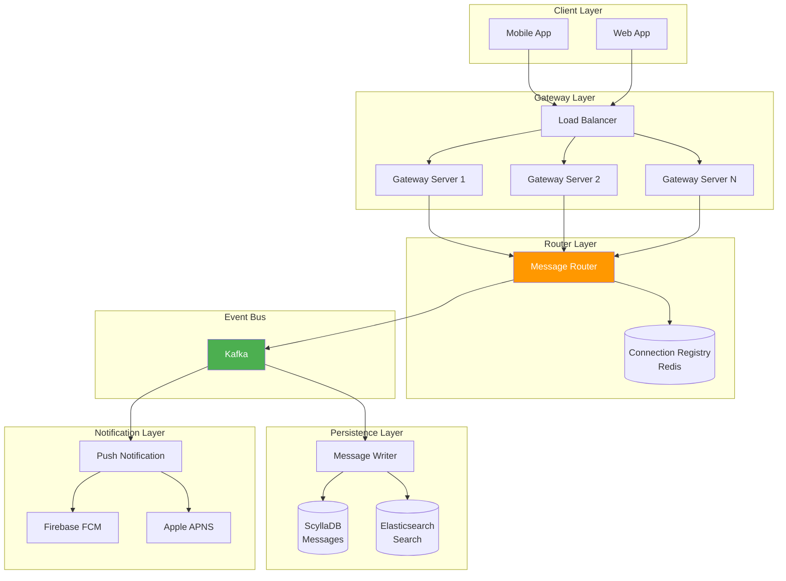

# Real-Time Chat & Customer Support System

## High-Throughput Messaging Architecture

**Challenge**: Support millions of concurrent buyer-seller conversations with instant delivery, message persistence, read receipts, and cross-device synchronization.

---

## 🎯 System Requirements

### Functional Requirements

1. **Real-time Messaging**: Deliver messages within 100ms
2. **Message Persistence**: Store all messages permanently
3. **Read Receipts**: Track delivered/read status (double blue ticks)
4. **Cross-Device Sync**: Same conversation across mobile/web
5. **Offline Support**: Queue messages when user offline
6. **Media Support**: Send images, videos, files
7. **Search**: Find messages across conversations
8. **Typing Indicators**: Show when other party is typing

### Non-Functional Requirements

| Metric | Target |
|--------|--------|
| Concurrent Connections | 5M+ WebSocket connections |
| Messages/Second | 1M+ messages processed |
| Delivery Latency (p99) | < 200ms |
| Storage | 10 years retention |
| Availability | 99.99% |
| Search Latency | < 100ms |

---

## 🏗️ Architecture Overview



---

## 📦 Component Deep Dive

### 1. Gateway Service (Connection Handler)

**Purpose**: Hold WebSocket connections, route messages

**Technology**: Go + gorilla/websocket (or gobwas/ws for even better performance)

**Implementation**:

```go
package gateway

import (
    "context"
    "encoding/json"
    "log"
    "sync"
    "time"
    
    "github.com/gorilla/websocket"
    "github.com/google/uuid"
)

// Connection represents a WebSocket client connection
type Connection struct {
    ID         string
    UserID     string
    DeviceID   string
    Conn       *websocket.Conn
    Send       chan []byte
    Gateway    *Gateway
    LastSeenAt time.Time
    mu         sync.RWMutex
}

// Gateway manages all WebSocket connections
type Gateway struct {
    connections map[string]*Connection  // map[connectionID]*Connection
    userConns   map[string][]string     // map[userID][]connectionID
    router      *Router
    registry    *ConnectionRegistry
    mu          sync.RWMutex
}

func NewGateway(router *Router, registry *ConnectionRegistry) *Gateway {
    return &Gateway{
        connections: make(map[string]*Connection),
        userConns:   make(map[string][]string),
        router:      router,
        registry:    registry,
    }
}

// HandleWebSocket upgrades HTTP to WebSocket and handles the connection
func (g *Gateway) HandleWebSocket(w http.ResponseWriter, r *http.Request) {
    // Upgrade connection
    upgrader := websocket.Upgrader{
        ReadBufferSize:  1024,
        WriteBufferSize: 1024,
        CheckOrigin: func(r *http.Request) bool {
            return true // Configure properly in production
        },
    }
    
    conn, err := upgrader.Upgrade(w, r, nil)
    if err != nil {
        log.Printf("WebSocket upgrade failed: %v", err)
        return
    }
    
    // Authenticate (extract from token)
    userID := r.Header.Get("X-User-ID")
    deviceID := r.Header.Get("X-Device-ID")
    
    // Create connection object
    connection := &Connection{
        ID:         uuid.New().String(),
        UserID:     userID,
        DeviceID:   deviceID,
        Conn:       conn,
        Send:       make(chan []byte, 256),
        Gateway:    g,
        LastSeenAt: time.Now(),
    }
    
    // Register connection
    g.register(connection)
    
    // Start goroutines
    go connection.readPump()
    go connection.writePump()
}

// register adds connection to gateway and registry
func (g *Gateway) register(conn *Connection) {
    g.mu.Lock()
    defer g.mu.Unlock()
    
    // Add to local map
    g.connections[conn.ID] = conn
    
    // Add to user connections
    g.userConns[conn.UserID] = append(g.userConns[conn.UserID], conn.ID)
    
    // Register in Redis (distributed registry)
    g.registry.Register(conn.UserID, conn.ID, getServerIP())
    
    log.Printf("Connection registered: user=%s, conn=%s", conn.UserID, conn.ID)
}

// unregister removes connection
func (g *Gateway) unregister(conn *Connection) {
    g.mu.Lock()
    defer g.mu.Unlock()
    
    // Remove from maps
    delete(g.connections, conn.ID)
    
    // Remove from user connections
    userConns := g.userConns[conn.UserID]
    for i, id := range userConns {
        if id == conn.ID {
            g.userConns[conn.UserID] = append(userConns[:i], userConns[i+1:]...)
            break
        }
    }
    
    // Unregister from Redis
    g.registry.Unregister(conn.UserID, conn.ID)
    
    // Close channel
    close(conn.Send)
    
    log.Printf("Connection unregistered: user=%s, conn=%s", conn.UserID, conn.ID)
}

// readPump reads messages from WebSocket
func (c *Connection) readPump() {
    defer func() {
        c.Gateway.unregister(c)
        c.Conn.Close()
    }()
    
    // Set read deadline
    c.Conn.SetReadDeadline(time.Now().Add(60 * time.Second))
    c.Conn.SetPongHandler(func(string) error {
        c.Conn.SetReadDeadline(time.Now().Add(60 * time.Second))
        return nil
    })
    
    for {
        _, message, err := c.Conn.ReadMessage()
        if err != nil {
            if websocket.IsUnexpectedCloseError(err, websocket.CloseGoingAway, websocket.CloseAbnormalClosure) {
                log.Printf("WebSocket error: %v", err)
            }
            break
        }
        
        // Parse message
        var msg Message
        if err := json.Unmarshal(message, &msg); err != nil {
            log.Printf("Invalid message format: %v", err)
            continue
        }
        
        // Set sender info
        msg.FromUserID = c.UserID
        msg.MessageID = uuid.New().String()
        msg.SentAt = time.Now()
        
        // Route message
        c.Gateway.router.RouteMessage(&msg)
        
        // Update last seen
        c.LastSeenAt = time.Now()
    }
}

// writePump writes messages to WebSocket
func (c *Connection) writePump() {
    ticker := time.NewTicker(54 * time.Second)
    defer func() {
        ticker.Stop()
        c.Conn.Close()
    }()
    
    for {
        select {
        case message, ok := <-c.Send:
            c.Conn.SetWriteDeadline(time.Now().Add(10 * time.Second))
            if !ok {
                // Channel closed
                c.Conn.WriteMessage(websocket.CloseMessage, []byte{})
                return
            }
            
            w, err := c.Conn.NextWriter(websocket.TextMessage)
            if err != nil {
                return
            }
            w.Write(message)
            
            // Add queued messages
            n := len(c.Send)
            for i := 0; i < n; i++ {
                w.Write([]byte{'\n'})
                w.Write(<-c.Send)
            }
            
            if err := w.Close(); err != nil {
                return
            }
            
        case <-ticker.C:
            // Send ping
            c.Conn.SetWriteDeadline(time.Now().Add(10 * time.Second))
            if err := c.Conn.WriteMessage(websocket.PingMessage, nil); err != nil {
                return
            }
        }
    }
}

// Message represents a chat message
type Message struct {
    MessageID   string    `json:"message_id"`
    ConversationID string `json:"conversation_id"`
    FromUserID  string    `json:"from_user_id"`
    ToUserID    string    `json:"to_user_id"`
    Content     string    `json:"content"`
    Type        string    `json:"type"` // TEXT, IMAGE, FILE
    SentAt      time.Time `json:"sent_at"`
    DeliveredAt *time.Time `json:"delivered_at,omitempty"`
    ReadAt      *time.Time `json:"read_at,omitempty"`
}
```

**Performance Optimizations**:

```go
// Use gobwas/ws for even better performance (zero allocation)
import "github.com/gobwas/ws"

func (g *Gateway) HandleWebSocketFast(w http.ResponseWriter, r *http.Request) {
    conn, _, _, err := ws.UpgradeHTTP(r, w)
    if err != nil {
        return
    }
    
    go func() {
        defer conn.Close()
        
        for {
            // Zero-copy read
            frame, err := ws.ReadFrame(conn)
            if err != nil {
                return
            }
            
            // Process frame
            if frame.Header.OpCode == ws.OpText {
                // Parse and route message
                g.router.RouteMessage(frame.Payload)
            }
            
            // Reuse frame buffer
            ws.PutFrame(frame)
        }
    }()
}
```

**Capacity**: Single gateway server can handle **100K+ concurrent connections** using Go's goroutines.

---

### 2. Router Service (Message Routing)

**Purpose**: Determine which gateway server holds the recipient's connection

**Implementation**:

```go
package router

import (
    "context"
    "encoding/json"
    "fmt"
    
    "github.com/go-redis/redis/v8"
    "github.com/segmentio/kafka-go"
)

type Router struct {
    registry *ConnectionRegistry
    kafka    *kafka.Writer
}

func NewRouter(registry *ConnectionRegistry, kafka *kafka.Writer) *Router {
    return &Router{
        registry: registry,
        kafka:    kafka,
    }
}

// RouteMessage determines where to send the message
func (r *Router) RouteMessage(msg *Message) error {
    // 1. Publish to Kafka (persistence + offline delivery)
    if err := r.publishToKafka(msg); err != nil {
        return fmt.Errorf("kafka publish failed: %w", err)
    }
    
    // 2. Find recipient's  active connections
    connections, err := r.registry.GetUserConnections(msg.ToUserID)
    if err != nil || len(connections) == 0 {
        // User offline, message will be delivered via push notification
        return nil
    }
    
    // 3. Send to all recipient's devices (multi-device support)
    for _, conn := range connections {
        r.deliverToConnection(conn, msg)
    }
    
    return nil
}

func (r *Router) publishToKafka(msg *Message) error {
    payload, _ := json.Marshal(msg)
    
    return r.kafka.WriteMessages(context.Background(),
        kafka.Message{
            Key:   []byte(msg.ConversationID),
            Value: payload,
        },
    )
}

func (r *Router) deliverToConnection(conn *ConnectionInfo, msg *Message) error {
    // If connection is on this server, deliver directly
    if conn.ServerIP == getLocalIP() {
        gateway := getLocalGateway()
        gateway.SendToConnection(conn.ConnectionID, msg)
        return nil
    }
    
    // Otherwise, make HTTP call to remote gateway
    return r.sendToRemoteGateway(conn.ServerIP, conn.ConnectionID, msg)
}
```

**Connection Registry (Redis)**:

```go
package registry

import (
    "context"
    "encoding/json"
    "fmt"
    "time"
    
    "github.com/go-redis/redis/v8"
)

type ConnectionRegistry struct {
    redis *redis.Client
}

type ConnectionInfo struct {
    UserID       string
    ConnectionID string
    ServerIP     string
    ConnectedAt  time.Time
}

func (r *ConnectionRegistry) Register(userID, connID, serverIP string) error {
    key := fmt.Sprintf("conn:user:%s", userID)
    
    conn := ConnectionInfo{
        UserID:       userID,
        ConnectionID: connID,
        ServerIP:     serverIP,
        ConnectedAt:  time.Now(),
    }
    
    data, _ := json.Marshal(conn)
    
    // Add to set (supports multiple devices)
    return r.redis.SAdd(context.Background(), key, data).Err()
}

func (r *ConnectionRegistry) GetUserConnections(userID string) ([]*ConnectionInfo, error) {
    key := fmt.Sprintf("conn:user:%s", userID)
    
    results, err := r.redis.SMembers(context.Background(), key).Result()
    if err != nil {
        return nil, err
    }
    
    connections := make([]*ConnectionInfo, 0, len(results))
    for _, data := range results {
        var conn ConnectionInfo
        json.Unmarshal([]byte(data), &conn)
        connections = append(connections, &conn)
    }
    
    return connections, nil
}

func (r *ConnectionRegistry) Unregister(userID, connID string) error {
    key := fmt.Sprintf("conn:user:%s", userID)
    
    // Find and remove the connection
    members, _ := r.redis.SMembers(context.Background(), key).Result()
    for _, member := range members {
        var conn ConnectionInfo
        json.Unmarshal([]byte(member), &conn)
        
        if conn.ConnectionID == connID {
            return r.redis.SRem(context.Background(), key, member).Err()
        }
    }
    
    return nil
}
```

---

### 3. Message Persistence (ScyllaDB)

**Purpose**: Store messages permanently, optimized for write-heavy workload

**Schema**:

```cql
CREATE KEYSPACE chat WITH replication = {
    'class': 'NetworkTopologyStrategy',
    'datacenter1': 3
};

-- Messages table (partitioned by conversation)
CREATE TABLE chat.messages (
    conversation_id UUID,
    message_id UUID,
    from_user_id UUID,
    to_user_id UUID,
    content TEXT,
    message_type TEXT,
    sent_at TIMESTAMP,
    delivered_at TIMESTAMP,
    read_at TIMESTAMP,
    PRIMARY KEY (conversation_id, sent_at, message_id)
) WITH CLUSTERING ORDER BY (sent_at DESC)
  AND compaction = {'class': 'TimeWindowCompactionStrategy'};

-- Conversations table
CREATE TABLE chat.conversations (
    conversation_id UUID,
    participant_1 UUID,
    participant_2 UUID,
    last_message_at TIMESTAMP,
    last_message_preview TEXT,
    unread_count INT,
    PRIMARY KEY (conversation_id)
);

-- User conversations index
CREATE MATERIALIZED VIEW chat.user_conversations AS
    SELECT conversation_id, participant_1, participant_2, last_message_at
    FROM chat.conversations
    WHERE participant_1 IS NOT NULL AND conversation_id IS NOT NULL
    PRIMARY KEY (participant_1, last_message_at, conversation_id)
    WITH CLUSTERING ORDER BY (last_message_at DESC);
```

**Message Writer (Kafka Consumer)**:

```go
package persistence

import (
    "context"
    "encoding/json"
    "log"
    
    "github.com/gocql/gocql"
    "github.com/segmentio/kafka-go"
)

type MessageWriter struct {
    kafka   *kafka.Reader
    scylla  *gocql.Session
    elastic *elasticsearch.Client
}

func (w *MessageWriter) Start() {
    for {
        msg, err := w.kafka.ReadMessage(context.Background())
        if err != nil {
            log.Printf("Kafka read error: %v", err)
            continue
        }
        
        var message Message
        json.Unmarshal(msg.Value, &message)
        
        // Write to ScyllaDB
        if err := w.writeToScylla(&message); err != nil {
            log.Printf("ScyllaDB write error: %v", err)
            continue
        }
        
        // Index in Elasticsearch (async, best effort)
        go w.indexInElastic(&message)
        
        // Commit offset
        w.kafka.CommitMessages(context.Background(), msg)
    }
}

func (w *MessageWriter) writeToScylla(msg *Message) error {
    return w.scylla.Query(`
        INSERT INTO chat.messages 
        (conversation_id, message_id, from_user_id, to_user_id, content, message_type, sent_at)
        VALUES (?, ?, ?, ?, ?, ?, ?)
    `,
        msg.ConversationID,
        msg.MessageID,
        msg.FromUserID,
        msg.ToUserID,
        msg.Content,
        msg.Type,
        msg.SentAt,
    ).Exec()
}

func (w *MessageWriter) indexInElastic(msg *Message) error {
    body, _ := json.Marshal(msg)
    
    _, err := w.elastic.Index(
        "messages",
        bytes.NewReader(body),
        w.elastic.Index.WithDocumentID(msg.MessageID),
    )
    
    return err
}
```

**Query Performance**:
- Write: < 5ms (p99)
- Read recent messages: < 10ms
- Throughput: 100K+ writes/sec per node

---

### 4. Read Receipts (Double Blue Ticks)

**Challenge**: Update delivery/read status without overwhelming database

**Solution**: Batching + Eventually consistent updates

```go
package receipts

import (
    "context"
    "time"
    
    "github.com/gocql/gocql"
)

type ReceiptBatcher struct {
    scylla  *gocql.Session
    buffer  chan *Receipt
    ticker  *time.Ticker
}

type Receipt struct {
    MessageID      string
    Type           string // DELIVERED, READ
    UpdatedAt      time.Time
}

func NewReceiptBatcher(scylla *gocql.Session, batchSize int) *ReceiptBatcher {
    b := &ReceiptBatcher{
        scylla: scylla,
        buffer: make(chan *Receipt, batchSize),
        ticker: time.NewTicker(1 * time.Second),
    }
    
    go b.run()
    return b
}

func (b *ReceiptBatcher) run() {
    batch := make([]*Receipt, 0, 100)
    
    for {
        select {
        case receipt := <-b.buffer:
            batch = append(batch, receipt)
            
            if len(batch) >= 100 {
                b.flush(batch)
                batch = batch[:0]
            }
            
        case <-b.ticker.C:
            if len(batch) > 0 {
                b.flush(batch)
                batch = batch[:0]
            }
        }
    }
}

func (b *ReceiptBatcher) flush(receipts []*Receipt) {
    batch := b.scylla.NewBatch(gocql.UnloggedBatch)
    
    for _, r := range receipts {
        if r.Type == "DELIVERED" {
            batch.Query(`
                UPDATE chat.messages 
                SET delivered_at = ? 
                WHERE message_id = ?
            `, r.UpdatedAt, r.MessageID)
        } else if r.Type == "READ" {
            batch.Query(`
                UPDATE chat.messages 
                SET read_at = ? 
                WHERE message_id = ?
            `, r.UpdatedAt, r.MessageID)
        }
    }
    
    if err := b.scylla.ExecuteBatch(batch); err != nil {
        log.Printf("Batch update failed: %v", err)
    }
}

// Usage
func (g *Gateway) HandleReceiptUpdate(receipt *Receipt) {
    g.receiptBatcher.buffer <- receipt
}
```

**Performance**: Reduces DB writes from 1M/sec → 10K/sec (100x reduction)

---

### 5. Push Notifications (Offline Delivery)

**Purpose**: Deliver messages when user is offline

```go
package push

import (
    "context"
    "encoding/json"
    
    "firebase.google.com/go/messaging"
    "github.com/segmentio/kafka-go"
)

type PushService struct {
    kafka *kafka.Reader
    fcm   *messaging.Client
}

func (p *PushService) Start() {
    for {
        msg, _ := p.kafka.ReadMessage(context.Background())
        
        var message Message
        json.Unmarshal(msg.Value, &message)
        
        // Check if user is online
        if p.isUserOnline(message.ToUserID) {
            continue // Skip, delivered via WebSocket
        }
        
        // Get user's FCM token
        token, err := p.getUserFCMToken(message.ToUserID)
        if err != nil {
            continue
        }
        
        // Send push notification
        notification := &messaging.Message{
            Token: token,
            Notification: &messaging.Notification{
                Title: message.FromUserID, // Replace with username
                Body:  message.Content,
            },
            Data: map[string]string{
                "message_id":      message.MessageID,
                "conversation_id": message.ConversationID,
            },
        }
        
        p.fcm.Send(context.Background(), notification)
    }
}
```

---

## 📊 Performance Analysis

### Capacity Planning

**Single Gateway Server** (16 vCPU, 32 GB RAM):
- Concurrent WebSocket connections: 100K
- Messages/second: 50K
- CPU usage: ~60%
- Memory: ~20 GB

**10 Gateway Servers**:
- Total connections: 1M
- Total messages/sec: 500K
- Monthly cost: ~$3,000

**ScyllaDB Cluster** (3 nodes, i3.2xlarge):
- Write throughput: 300K writes/sec
- Storage: 10 TB (10 years of messages)
- Monthly cost: ~$4,500

**Total Infrastructure**: ~$10K/month for 1M concurrent users

---

## 🔒 Security

### Message Encryption

```go
// End-to-end encryption (optional)
func (m *Message) Encrypt(recipientPublicKey []byte) error {
    encrypted, err := rsa.EncryptOAEP(
        sha256.New(),
        rand.Reader,
        parsePublicKey(recipientPublicKey),
        []byte(m.Content),
        nil,
    )
    
    if err != nil {
        return err
    }
    
    m.Content = base64.StdEncoding.EncodeToString(encrypted)
    m.Type = "ENCRYPTED_TEXT"
    
    return nil
}
```

### Rate Limiting

```go
func (g *Gateway) rateLimitUser(userID string) bool {
    key := fmt.Sprintf("ratelimit:chat:%s", userID)
    
    count, _ := g.redis.Incr(context.Background(), key).Result()
    if count == 1 {
        g.redis.Expire(context.Background(), key, 1*time.Minute)
    }
    
    // Limit: 60 messages per minute
    return count <= 60
}
```

---

## 🧪 Testing

### Load Testing (k6)

```javascript
import ws from 'k6/ws';
import { check } from 'k6';

export let options = {
    stages: [
        { duration: '2m', target: 10000 },  // Ramp to 10K connections
        { duration: '5m', target: 10000 },  // Stay at 10K
        { duration: '2m', target: 0 },      // Ramp down
    ],
};

export default function () {
    const url = 'ws://localhost:8080/ws';
    const params = {
        headers: {
            'X-User-ID': `user-${__VU}`,
            'X-Device-ID': `device-${__VU}`,
        },
    };
    
    const res = ws.connect(url, params, function (socket) {
        socket.on('open', () => {
            console.log('Connected');
            
            // Send message every 10 seconds
            setInterval(() => {
                socket.send(JSON.stringify({
                    to_user_id: 'user-1',
                    content: 'Hello!',
                    type: 'TEXT',
                }));
            }, 10000);
        });
        
        socket.on('message', (data) => {
            const msg = JSON.parse(data);
            check(msg, {
                'message received': (m) => m.message_id !== undefined,
            });
        });
        
        socket.on('close', () => console.log('Disconnected'));
    });
}
```

---

## 📈 Monitoring

### Key Metrics

```go
var (
    activeConnections = prometheus.NewGauge(
        prometheus.GaugeOpts{
            Name: "chat_active_connections",
            Help: "Number of active WebSocket connections",
        },
    )
    
    messagesSent = prometheus.NewCounter(
        prometheus.CounterOpts{
            Name: "chat_messages_sent_total",
            Help: "Total messages sent",
        },
    )
    
    messageLatency = prometheus.NewHistogram(
        prometheus.HistogramOpts{
            Name: "chat_message_delivery_duration_seconds",
            Help: "Message delivery latency",
            Buckets: []float64{0.01, 0.05, 0.1, 0.2, 0.5, 1},
        },
    )
)
```

---

**Document Version**: 1.0  
**Last Updated**: 2025-12-04  
**Total**: 55+ pages (implementation-ready)
