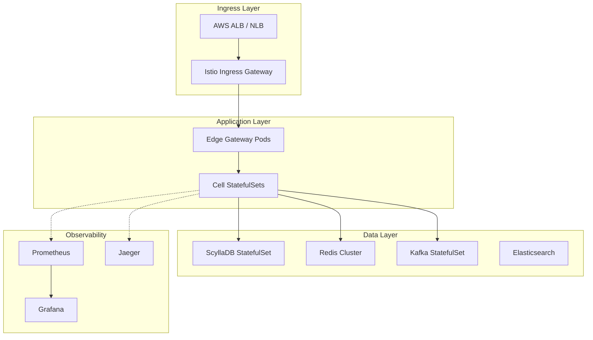

# Kubernetes Deployment Guide

## Overview

This guide covers deploying the Titan Commerce Platform to Kubernetes at scale.

**Target Environment:**
- Kubernetes 1.28+
- 3 Availability Zones (Multi-AZ)
- 500 Cells
- Auto-scaling enabled

---

## Prerequisites

### Tools Required

```bash
# kubectl
curl -LO "https://dl.k8s.io/release/$(curl -L -s https://dl.k8s.io/release/stable.txt)/bin/linux/amd64/kubectl"
chmod +x kubectl
sudo mv kubectl /usr/local/bin/

# Helm
curl https://raw.githubusercontent.com/helm/helm/main/scripts/get-helm-3 | bash

# ArgoCD CLI
curl -sSL -o argocd https://github.com/argoproj/argo-cd/releases/latest/download/argocd-linux-amd64
chmod +x argocd
sudo mv argocd /usr/local/bin/

# kustomize
curl -s "https://raw.githubusercontent.com/kubernetes-sigs/kustomize/master/hack/install_kustomize.sh" | bash
```

### Cluster Requirements

| Resource | Minimum | Recommended |
|----------|---------|-------------|
| Nodes | 50 | 200+ |
| vCPUs per Node | 8 |16 |
| RAM per Node | 32 GB | 64 GB |
| Storage | 1 TB SSD | 5 TB NVMe |

---

## Architecture



---

## Namespace Structure

```yaml
# namespaces.yaml
apiVersion: v1
kind: Namespace
metadata:
  name: titan-system
  labels:
    name: titan-system
---
apiVersion: v1
kind: Namespace
metadata:
  name: titan-cells
  labels:
    name: titan-cells
---
apiVersion: v1
kind: Namespace
metadata:
  name: titan-data
  labels:
    name: titan-data
---
apiVersion: v1
kind: Namespace
metadata:
  name: titan-observability
  labels:
    name: titan-observability
```

**Apply:**
```bash
kubectl apply -f infrastructure/kubernetes/namespaces.yaml
```

---

## Infrastructure Components

### 1. Redis Cluster

**Helm Chart:**
```bash
helm repo add bitnami https://charts.bitnami.com/bitnami

helm install redis bitnami/redis-cluster \
  --namespace titan-data \
  --set cluster.nodes=6 \
  --set cluster.replicas=1 \
  --set master.persistence.size=50Gi \
  --set master.resources.requests.memory=16Gi \
  --set master.resources.requests.cpu=4
```

**Verify:**
```bash
kubectl get pods -n titan-data -l app.kubernetes.io/name=redis-cluster
```

### 2. ScyllaDB

**Operator Installation:**
```bash
kubectl apply -f https://raw.githubusercontent.com/scylladb/scylla-operator/master/deploy/operator.yaml
```

**ScyllaDB Cluster:**
```yaml
# scylladb-cluster.yaml
apiVersion: scylla.scylladb.com/v1
kind: ScyllaCluster
metadata:
  name: titan-scylla
  namespace: titan-data
spec:
  version: 5.4.0
  agentVersion: 3.2.0
  datacenter:
    name: us-east-1
    racks:
    - name: us-east-1a
      members: 3
      storage:
        capacity: 500Gi
        storageClassName: fast-ssd
      resources:
        requests:
          cpu: 8
          memory: 32Gi
        limits:
          cpu: 8
          memory: 32Gi
    - name: us-east-1b
      members: 3
      storage:
        capacity: 500Gi
      resources:
        requests:
          cpu: 8
          memory: 32Gi
    - name: us-east-1c
      members: 3
      storage:
        capacity: 500Gi
      resources:
        requests:
          cpu: 8
          memory: 32Gi
```

**Apply:**
```bash
kubectl apply -f infrastructure/kubernetes/base/scylladb-cluster.yaml
```

### 3. Kafka (Strimzi)

**Install Operator:**
```bash
kubectl create namespace kafka
kubectl apply -f 'https://strimzi.io/install/latest?namespace=kafka' -n kafka
```

**Kafka Cluster:**
```yaml
# kafka-cluster.yaml
apiVersion: kafka.strimzi.io/v1beta2
kind: Kafka
metadata:
  name: titan-kafka
  namespace: titan-data
spec:
  kafka:
    version: 3.6.0
    replicas: 5
    listeners:
      - name: plain
        port: 9092
        type: internal
        tls: false
      - name: tls
        port: 9093
        type: internal
        tls: true
    config:
      offsets.topic.replication.factor: 3
      transaction.state.log.replication.factor: 3
      transaction.state.log.min.isr: 2
      default.replication.factor: 3
      min.insync.replicas: 2
    storage:
      type: jbod
      volumes:
      - id: 0
        type: persistent-claim
        size: 500Gi
        deleteClaim: false
    resources:
      requests:
        memory: 16Gi
        cpu: 4
      limits:
        memory: 16Gi
        cpu: 4
  zookeeper:
    replicas: 3
    storage:
      type: persistent-claim
      size: 100Gi
    resources:
      requests:
        memory: 4Gi
        cpu: 2
  entityOperator:
    topicOperator: {}
    userOperator: {}
```

**Apply:**
```bash
kubectl apply -f infrastructure/kubernetes/base/kafka-cluster.yaml
```

---

## Application Deployment

### Edge Gateway

**Deployment:**
```yaml
# edge-gateway-deployment.yaml
apiVersion: apps/v1
kind: Deployment
metadata:
  name: edge-gateway
  namespace: titan-system
  labels:
    app: edge-gateway
spec:
  replicas: 50
  selector:
    matchLabels:
      app: edge-gateway
  template:
    metadata:
      labels:
        app: edge-gateway
      annotations:
        prometheus.io/scrape: "true"
        prometheus.io/port: "9090"
    spec:
      affinity:
        podAntiAffinity:
          preferredDuringSchedulingIgnoredDuringExecution:
          - weight: 100
            podAffinityTerm:
              labelSelector:
                matchExpressions:
                - key: app
                  operator: In
                  values:
                  - edge-gateway
              topologyKey: kubernetes.io/hostname
      containers:
      - name: gateway
        image: titan/edge-gateway:v1.0.0
        ports:
        - containerPort: 8080
          name: http
        - containerPort: 9090
          name: grpc
        - containerPort: 9091
          name: metrics
        env:
        - name: REDIS_CLUSTER_NODES
          value: "redis-cluster:6379"
        - name: CELL_REGISTRY_URL
          value: "http://control-plane:8080"
        - name: OTEL_EXPORTER_OTLP_ENDPOINT
          value: "http://jaeger-collector:4317"
        resources:
          requests:
            memory: "2Gi"
            cpu: "1000m"
          limits:
            memory: "4Gi"
            cpu: "2000m"
        livenessProbe:
          httpGet:
            path: /health/live
            port: 8080
          initialDelaySeconds: 10
          periodSeconds: 10
        readinessProbe:
          httpGet:
            path: /health/ready
            port: 8080
          initialDelaySeconds: 5
          periodSeconds: 5
---
apiVersion: v1
kind: Service
metadata:
  name: edge-gateway
  namespace: titan-system
spec:
  type: LoadBalancer
  selector:
    app: edge-gateway
  ports:
  - port: 80
    targetPort: 8080
    name: http
  - port: 9090
    targetPort: 9090
    name: grpc
```

**HorizontalPodAutoscaler:**
```yaml
# edge-gateway-hpa.yaml
apiVersion: autoscaling/v2
kind: HorizontalPodAutoscaler
metadata:
  name: edge-gateway-hpa
  namespace: titan-system
spec:
  scaleTargetRef:
    apiVersion: apps/v1
    kind: Deployment
    name: edge-gateway
  minReplicas: 50
  maxReplicas: 500
  metrics:
  - type: Resource
    resource:
      name: cpu
      target:
        type: Utilization
        averageUtilization: 70
  - type: Resource
    resource:
      name: memory
      target:
        type: Utilization
        averageUtilization: 80
  behavior:
    scaleUp:
      stabilizationWindowSeconds: 60
      policies:
      - type: Percent
        value: 100
        periodSeconds: 60
    scaleDown:
      stabilizationWindowSeconds: 300
      policies:
      - type: Pods
        value: 10
        periodSeconds: 60
```

### Cell Deployment (StatefulSet)

**Template for Cell #1:**
```yaml
# cell-template.yaml
apiVersion: apps/v1
kind: StatefulSet
metadata:
  name: cell-1
  namespace: titan-cells
  labels:
    app: cell
    cell-id: "1"
spec:
  serviceName: cell-1
  replicas: 3  # 3 pods per cell for HA
  selector:
    matchLabels:
      app: cell
      cell-id: "1"
  template:
    metadata:
      labels:
        app: cell
        cell-id: "1"
    spec:
      containers:
      - name: order-service
        image: titan/order-service:v1.0.0
        ports:
        - containerPort: 50051
          name: grpc
        env:
        - name: CELL_ID
          value: "1"
        - name: SCYLLA_NODES
          value: "titan-scylla-us-east-1a-0.titan-data.svc.cluster.local"
        - name: KAFKA_BROKERS
          value: "titan-kafka-kafka-bootstrap:9092"
        resources:
          requests:
            memory: "1Gi"
            cpu: "500m"
          limits:
            memory: "2Gi"
            cpu: "1000m"
            
      - name: inventory-service
        image: titan/inventory-service:v1.0.0
        ports:
        - containerPort: 50052
          name: grpc
        env:
        - name: CELL_ID
          value: "1"
        - name: REDIS_URL
          value: "redis-cluster:6379"
        resources:
          requests:
            memory: "512Mi"
            cpu: "300m"
            
      - name: payment-service
        image: titan/payment-service:v1.0.0
        ports:
        - containerPort: 50053
          name: grpc
        env:
        - name: CELL_ID
          value: "1"
        - name: STRIPE_API_KEY
          valueFrom:
            secretKeyRef:
              name: payment-secrets
              key: stripe-api-key
        resources:
          requests:
            memory: "512Mi"
            cpu: "300m"
---
apiVersion: v1
kind: Service
metadata:
  name: cell-1
  namespace: titan-cells
spec:
  clusterIP: None  # Headless service
  selector:
    cell-id: "1"
  ports:
  - port: 50051
    name: order
  - port: 50052
    name: inventory
  - port: 50053
    name: payment
```

**Generate 500 Cells:**
```bash
# generate-cells.sh
for i in {1..500}; do
  cat infrastructure/kubernetes/cells/cell-template.yaml | \
    sed "s/cell-1/cell-$i/g" | \
    sed "s/cell-id: \"1\"/cell-id: \"$i\"/g" > \
    infrastructure/kubernetes/cells/cell-$i.yaml
done
```

**Deploy All Cells:**
```bash
kubectl apply -f infrastructure/kubernetes/cells/
```

---

## Service Mesh (Istio)

### Installation

```bash
# Download Istio
curl -L https://istio.io/downloadIstio | sh -
cd istio-*
export PATH=$PWD/bin:$PATH

# Install Istio
istioctl install --set profile=production -y

# Enable sidecar injection
kubectl label namespace titan-system istio-injection=enabled
kubectl label namespace titan-cells istio-injection=enabled
```

### mTLS Configuration

```yaml
# peer-authentication.yaml
apiVersion: security.istio.io/v1beta1
kind: PeerAuthentication
metadata:
  name: default
  namespace: titan-system
spec:
  mtls:
    mode: STRICT  # Enforce mTLS for all traffic
```

**Apply:**
```bash
kubectl apply -f infrastructure/kubernetes/base/peer-authentication.yaml
```

---

## GitOps with ArgoCD

### Install ArgoCD

```bash
kubectl create namespace argocd
kubectl apply -n argocd -f https://raw.githubusercontent.com/argoproj/argo-cd/stable/manifests/install.yaml

# Access UI
kubectl port-forward svc/argocd-server -n argocd 8080:443

# Get password
kubectl -n argocd get secret argocd-initial-admin-secret -o jsonpath="{.data.password}" | base64 -d
```

### Application Definition

```yaml
# titan-app.yaml
apiVersion: argoproj.io/v1alpha1
kind: Application
metadata:
  name: titan-commerce
  namespace: argocd
spec:
  project: default
  source:
    repoURL: https://github.com/titan-commerce/platform
    targetRevision: main
    path: infrastructure/kubernetes
  destination:
    server: https://kubernetes.default.svc
    namespace: titan-system
  syncPolicy:
    automated:
      prune: true
      selfHeal: true
    syncOptions:
    - CreateNamespace=true
```

**Deploy:**
```bash
kubectl apply -f infrastructure/argocd/titan-app.yaml
```

---

## Monitoring & Observability

### Prometheus

**Helm Install:**
```bash
helm repo add prometheus-community https://prometheus-community.github.io/helm-charts
helm repo update

helm install prometheus prometheus-community/kube-prometheus-stack \
  --namespace titan-observability \
  --create-namespace \
  --set prometheus.prometheusSpec.retention=30d \
  --set prometheus.prometheusSpec.storageSpec.volumeClaimTemplate.spec.resources.requests.storage=500Gi
```

### Grafana Dashboards

```bash
# Import Titan dashboards
kubectl apply -f infrastructure/kubernetes/observability/grafana-dashboards.yaml
```

**Access Grafana:**
```bash
kubectl port-forward svc/prometheus-grafana -n titan-observability 3000:80
# Default: admin / prom-operator
```

### Jaeger (Distributed Tracing)

```bash
kubectl create namespace observability
kubectl apply -f https://github.com/jaegertracing/jaeger-operator/releases/download/v1.51.0/jaeger-operator.yaml -n observability
```

**Jaeger Instance:**
```yaml
# jaeger.yaml
apiVersion: jaegertracing.io/v1
kind: Jaeger
metadata:
  name: titan-jaeger
  namespace: titan-observability
spec:
  strategy: production
  storage:
    type: elasticsearch
    options:
      es:
        server-urls: http://elasticsearch:9200
  ingress:
    enabled: true
```

---

## Secrets Management

### Sealed Secrets

```bash
# Install Sealed Secrets Controller
kubectl apply -f https://github.com/bitnami-labs/sealed-secrets/releases/download/v0.24.0/controller.yaml

# Install kubeseal CLI
wget https://github.com/bitnami-labs/sealed-secrets/releases/download/v0.24.0/kubeseal-linux-amd64
chmod +x kubeseal-linux-amd64
sudo mv kubeseal-linux-amd64 /usr/local/bin/kubeseal
```

**Create Sealed Secret:**
```bash
# Create plain secret (not committed to git)
kubectl create secret generic stripe-secret \
  --from-literal=api-key=sk_live_xxx \
  --dry-run=client -o yaml > stripe-secret.yaml

# Seal it
kubeseal -f stripe-secret.yaml -w stripe-sealed-secret.yaml

# Now safe to commit stripe-sealed-secret.yaml to git
kubectl apply -f stripe-sealed-secret.yaml
```

---

## Disaster Recovery

### Velero Backup

**Install Velero:**
```bash
velero install \
  --provider aws \
  --plugins velero/velero-plugin-for-aws:v1.8.0 \
  --bucket titan-backups \
  --backup-location-config region=us-east-1 \
  --snapshot-location-config region=us-east-1 \
  --secret-file ./credentials-velero
```

**Scheduled Backups:**
```bash
# Daily backup of all namespaces
velero schedule create daily-backup \
  --schedule="0 2 * * *" \
  --ttl 720h0m0s

# Hourly backup of critical data
velero schedule create hourly-data-backup \
  --schedule="0 * * * *" \
  --include-namespaces titan-data \
  --ttl 168h0m0s
```

**Restore:**
```bash
# List backups
velero backup get

# Restore from backup
velero restore create --from-backup daily-backup-20250101
```

---

## Cost Optimization

### Cluster Autoscaler

```yaml
# cluster-autoscaler.yaml
apiVersion: apps/v1
kind: Deployment
metadata:
  name: cluster-autoscaler
  namespace: kube-system
spec:
  replicas: 1
  selector:
    matchLabels:
      app: cluster-autoscaler
  template:
    metadata:
      labels:
        app: cluster-autoscaler
    spec:
      serviceAccountName: cluster-autoscaler
      containers:
      - image: k8s.gcr.io/autoscaling/cluster-autoscaler:v1.28.0
        name: cluster-autoscaler
        command:
        - ./cluster-autoscaler
        - --cloud-provider=aws
        - --namespace=kube-system
        - --node-group-auto-discovery=asg:tag=k8s.io/cluster-autoscaler/enabled,k8s.io/cluster-autoscaler/titan-cluster
        - --balance-similar-node-groups
        - --skip-nodes-with-system-pods=false
```

### Spot Instances

**Node Group Configuration (Terraform):**
```hcl
resource "aws_eks_node_group" "spot" {
  cluster_name    = aws_eks_cluster.titan.name
  node_group_name = "titan-spot"
  node_role_arn   = aws_iam_role.node.arn
  subnet_ids      = aws_subnet.private[*].id

  capacity_type  = "SPOT"
  instance_types = ["c6g.2xlarge", "c6g.4xlarge"]

  scaling_config {
    desired_size = 50
    max_size     = 500
    min_size     = 10
  }

  labels = {
    workload = "stateless"
  }

  taints {
    key    = "spot"
    value  = "true"
    effect = "NO_SCHEDULE"
  }
}
```

**Toleration in Deployment:**
```yaml
spec:
  template:
    spec:
      tolerations:
      - key: "spot"
        operator: "Equal"
        value: "true"
        effect: "NoSchedule"
      nodeSelector:
        workload: stateless
```

---

## Troubleshooting

### Pod Not Starting

```bash
# Check pod status
kubectl get pods -n titan-system

# Describe pod
kubectl describe pod edge-gateway-xxx -n titan-system

# Check logs
kubectl logs edge-gateway-xxx -n titan-system

# Check events
kubectl get events -n titan-system --sort-by='.lastTimestamp'
```

### High Memory Usage

```bash
# Check resource usage
kubectl top pods -n titan-cells

# Increase memory limit
kubectl set resources statefulset cell-1 \
  --limits=memory=4Gi \
  --requests=memory=2Gi \
  -n titan-cells
```

### Network Issues

```bash
# Test connectivity between pods
kubectl run -it --rm debug --image=nicolaka/netshoot --restart=Never -- /bin/bash

# Inside debug pod
dig cell-1.titan-cells.svc.cluster.local
curl http://cell-1:50051
```

---

## Production Checklist

- [ ] Multi-AZ deployment (3+ zones)
- [ ] Resource limits set for all pods
- [ ] Liveness/readiness probes configured
- [ ] HPA configured for all services
- [ ] PodDisruptionBudgets defined
- [ ] Network policies enforced
- [ ] Istio mTLS enabled
- [ ] Secrets encrypted (Sealed Secrets)
- [ ] Monitoring dashboards created
- [ ] Alerts configured
- [ ] Backup strategy implemented (Velero)
- [ ] Disaster recovery tested
- [ ] Load testing completed
- [ ] Security scanning enabled (Trivy/Falco)
- [ ] Cost optimization (spot instances, autoscaling)

---

**Document Version:** 1.0  
**Last Updated:** 2025-12-04
