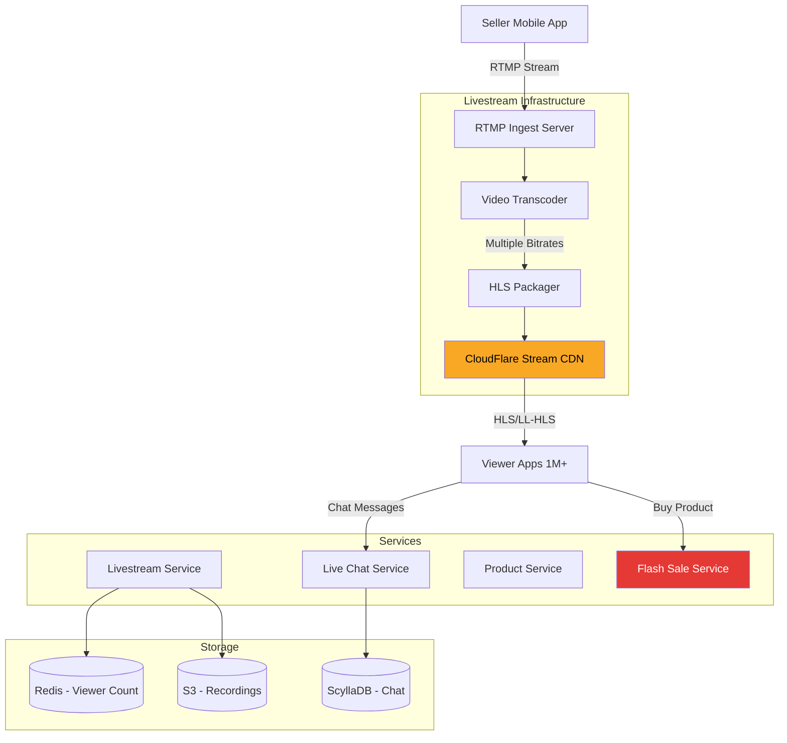

# Modern Shopee Features Implementation

## Advanced Features for Social Commerce & Engagement

**Purpose**: Complete implementation guide for modern e-commerce features inspired by Shopee, TikTok Shop, and Taobao Live.

---

## 🎥 Feature 1: Shopee Live (Livestream Shopping)

### Architecture



### Service Implementation

```go
// services/communication/livestream-service/internal/streaming/rtmp_server.go
package streaming

import (
    "github.com/nareix/joy4/av/pubsub"
    "github.com/nareix/joy4/format/rtmp"
)

type RTMPServer struct {
    server     *rtmp.Server
    queue      *pubsub.Queue
    transcoder *VideoTranscoder
    cdn        *CDNPusher
}

func NewRTMPServer() *RTMPServer {
    server := &rtmp.Server{
        Addr: ":1935",
    }
    
    queue := pubsub.NewQueue()
    
    s := &RTMPServer{
        server:     server,
        queue:      queue,
        transcoder: NewVideoTranscoder(),
        cdn:        NewCDNPusher(),
    }
    
    server.HandlePublish = s.handlePublish
    server.HandlePlay = s.handlePlay
    
    return s
}

func (s *RTMPServer) handlePublish(conn *rtmp.Conn) {
    streamKey := conn.URL.Path  // /live/seller-123
    
    // Validate seller can go live
    sellerID := extractSellerID(streamKey)
    if !s.canGoLive(sellerID) {
        conn.Close()
        return
    }
    
    // Create livestream session
    sessionID := s.createSession(sellerID)
    
    // Read video frames
    streams, _ := conn.Streams()
    
    // Transcode to multiple bitrates
    go s.transcoder.Transcode(streams, sessionID, []string{
        "1080p60",  // High quality
        "720p30",   // Medium
        "480p30",   // Low (mobile)
        "360p30",   // Very low (poor connection)
    })
    
    // Push to CDN
    go s.cdn.Push(sessionID, streams)
    
    // Publish to internal queue
    s.queue.WriteHeader(streams)
    for {
        packet, err := conn.ReadPacket()
        if err != nil {
            break
        }
        s.queue.WritePacket(packet)
    }
    
    s.endSession(sessionID)
}

func (s *RTMPServer) handlePlay(conn *rtmp.Conn) {
    // Viewers watch via HLS, not RTMP
    conn.Close()
}
```

### HLS Packaging

```go
// internal/streaming/hls_packager.go
package streaming

import (
    "github.com/grafov/m3u8"
    "time"
)

type HLSPackager struct {
    segmentDuration time.Duration
    s3Uploader      *S3Uploader
}

func (p *HLSPackager) PackageStream(sessionID string, videoStream io.Reader) error {
    playlist := m3u8.NewMediaPlaylist(10, 10)  // 10 segments
    
    segmentIndex := 0
    
    for {
        // Create 2-second segments
        segment, err := p.createSegment(videoStream, 2*time.Second)
        if err != nil {
            break
        }
        
        // Upload to S3
        segmentURL, err := p.s3Uploader.Upload(
            fmt.Sprintf("live/%s/segment_%d.ts", sessionID, segmentIndex),
            segment,
        )
        
        // Add to playlist
        playlist.Append(segmentURL, 2.0, "")
        segmentIndex++
        
        // Write playlist to S3 (master.m3u8)
        playlistContent, _ := playlist.Encode()
        p.s3Uploader.Upload(
            fmt.Sprintf("live/%s/master.m3u8", sessionID),
            playlistContent,
        )
        
        // Push to CDN (cache invalidation)
        p.invalidateCDNCache(sessionID)
    }
    
    // Mark as ended
    playlist.Close()
    return nil
}
```

### Live Chat Integration

```go
// internal/chat/live_chat.go
package chat

type LiveChatManager struct {
    redis      *redis.Client
    broadcaster *Broadcaster
}

func (m *LiveChatManager) SendMessage(sessionID, userID, message string) error {
    // Rate limit: 1 message per second per user
    key := fmt.Sprintf("ratelimit:chat:%s:%s", sessionID, userID)
    if m.redis.Exists(context.Background(), key).Val() > 0 {
        return ErrTooManyMessages
    }
    m.redis.Set(context.Background(), key, 1, 1*time.Second)
    
    // Persist message
    msg := &ChatMessage{
        MessageID:  uuid.New().String(),
        SessionID:  sessionID,
        UserID:     userID,
        Message:    message,
        SentAt:     time.Now(),
    }
    
    // Broadcast to all viewers (via WebSocket)
    m.broadcaster.Broadcast(sessionID, msg)
    
    return nil
}
```

### Pinned Products During Live

```go
// internal/products/pinned_products.go
package products

type LiveProductManager struct {
    redis *redis.Client
}

func (m *LiveProductManager) PinProduct(sessionID, productID string) error {
    // Only 5 products can be pinned at once
    key := fmt.Sprintf("live:pinned:%s", sessionID)
    
    count := m.redis.LLen(context.Background(), key).Val()
    if count >= 5 {
        // Remove oldest
        m.redis.LPop(context.Background(), key)
    }
    
    // Add new
    m.redis.RPush(context.Background(), key, productID)
    
    // Broadcast update to viewers
    m.notifyViewers(sessionID, "PRODUCT_PINNED", productID)
    
    return nil
}

func (m *LiveProductManager) StartFlashSale(sessionID, productID string, stock int) error {
    // Trigger flash sale for pinned product
    return flashSaleService.StartSale(productID, stock, 5*time.Minute)
}
```

### Viewer Analytics

```go
// internal/analytics/viewer_stats.go
package analytics

type ViewerAnalytics struct {
    clickhouse *clickhouse.Conn
    redis      *redis.Client
}

func (a *ViewerAnalytics) TrackViewer(sessionID, userID string) {
    // Real-time viewer count
    key := fmt.Sprintf("live:viewers:%s", sessionID)
    a.redis.SAdd(context.Background(), key, userID)
    a.redis.Expire(context.Background(), key, 30*time.Second)
    
    // Peak viewers
    count := a.redis.SCard(context.Background(), key).Val()
    peakKey := fmt.Sprintf("live:peak:%s", sessionID)
    currentPeak := a.redis.Get(context.Background(), peakKey).Val()
    
    if count > atoi(currentPeak) {
        a.redis.Set(context.Background(), peakKey, count, 0)
    }
    
    // Store in ClickHouse for analytics
    a.clickhouse.Exec(`
        INSERT INTO live_events (session_id, user_id, event_type, timestamp)
        VALUES (?, ?, ?, ?)
    `, sessionID, userID, "VIEW", time.Now())
}

func (a *ViewerAnalytics) GetSessionStats(sessionID string) (*SessionStats, error) {
    var stats SessionStats
    
    rows, _ := a.clickhouse.Query(`
        SELECT 
            COUNT(DISTINCT user_id) as unique_viewers,
            COUNT(*) as total_views,
            AVG(watch_duration_seconds) as avg_watch_time,
            SUM(CASE WHEN event_type = 'PURCHASE' THEN 1 ELSE 0 END) as purchases
        FROM live_events
        WHERE session_id = ?
    `, sessionID)
    
    rows.Scan(&stats.UniqueViewers, &stats.TotalViews, &stats.AvgWatchTime, &stats.Purchases)
    
    return &stats, nil
}
```

---

## 🎮 Feature 2: Gamification (Shopee Coins & Games)

### Shopee Coins System

```go
// services/marketing-engagement/gamification-service/internal/coins/balance.go
package coins

type CoinWallet struct {
    db     *sql.DB
    redis  *redis.Client
}

func (w *CoinWallet) EarnCoins(userID string, amount int, source string) error {
    // Transaction record
    tx, _ := w.db.Begin()
    
    // Update balance
    _, err := tx.Exec(`
        INSERT INTO coin_transactions (user_id, amount, source, created_at)
        VALUES ($1, $2, $3, NOW())
    `, userID, amount, source)
    
    if err != nil {
        tx.Rollback()
        return err
    }
    
    // Update total balance
    tx.Exec(`
        INSERT INTO coin_balances (user_id, balance)
        VALUES ($1, $2)
        ON CONFLICT (user_id)
        DO UPDATE SET balance = coin_balances.balance + EXCLUDED.balance
    `, userID, amount)
    
    tx.Commit()
    
    // Update Redis cache
    w.redis.IncrBy(context.Background(), fmt.Sprintf("coins:%s", userID), int64(amount))
    
    // Send notification
    w.notifyUser(userID, fmt.Sprintf("You earned %d Shopee Coins!", amount))
    
    return nil
}

func (w *CoinWallet) SpendCoins(userID string, amount int, orderID string) error {
    // Check balance
    balance := w.GetBalance(userID)
    if balance < amount {
        return ErrInsufficientCoins
    }
    
    // Deduct
    tx, _ := w.db.Begin()
    
    tx.Exec(`
        INSERT INTO coin_transactions (user_id, amount, source, order_id, created_at)
        VALUES ($1, $2, 'PURCHASE', $3, NOW())
    `, userID, -amount, orderID)
    
    tx.Exec(`
        UPDATE coin_balances SET balance = balance - $1 WHERE user_id = $2
    `, amount, userID)
    
    tx.Commit()
    
    // Update cache
    w.redis.DecrBy(context.Background(), fmt.Sprintf("coins:%s", userID), int64(amount))
    
    return nil
}
```

### Shake-Shake Game

```go
// internal/games/shake_shake.go
package games

import (
    "crypto/rand"
    "math/big"
)

type ShakeShakeGame struct {
    redis *redis.Client
}

func (g *ShakeShakeGame) Play(userID string, shakePower int) (*ShakeResult, error) {
    // Limit: 3 plays per day
    key := fmt.Sprintf("game:shake:%s:%s", userID, time.Now().Format("2006-01-02"))
    
    plays := g.redis.Incr(context.Background(), key).Val()
    if plays > 3 {
        return nil, ErrDailyLimitExceeded
    }
    
    g.redis.Expire(context.Background(), key, 24*time.Hour)
    
    // Calculate reward based on shake power (0-100)
    coinsWon := g.calculateReward(shakePower)
    
    // Award coins
    coinWallet.EarnCoins(userID, coinsWon, "SHAKE_SHAKE_GAME")
    
    return &ShakeResult{
        CoinsWon:      coinsWon,
        RemainingPlays: 3 - int(plays),
    }, nil
}

func (g *ShakeShakeGame) calculateReward(shakePower int) int {
    // Probability distribution
    // 70% chance: 1-10 coins
    // 25% chance: 11-50 coins
    // 4% chance: 51-100 coins
    // 1% chance: 500 coins (jackpot)
    
    randNum, _ := rand.Int(rand.Reader, big.NewInt(100))
    roll := int(randNum.Int64())
    
    if roll < 1 {
        return 500  // Jackpot!
    } else if roll < 5 {
        return int(shakePower * 0.5)  // 50-100 coins
    } else if roll < 30 {
        return int(shakePower * 0.3)  // 30-50 coins
    } else {
        return int(shakePower * 0.1)  // 10 coins
    }
}
```

### Daily Check-In

```go
// internal/games/daily_checkin.go
package games

type DailyCheckIn struct {
    db *sql.DB
}

func (d *DailyCheckIn) CheckIn(userID string) (*CheckInReward, error) {
    // Get consecutive days
    var lastCheckIn time.Time
    var consecutiveDays int
    
    d.db.QueryRow(`
        SELECT last_checkin, consecutive_days 
        FROM user_checkins 
        WHERE user_id = $1
    `, userID).Scan(&lastCheckIn, &consecutiveDays)
    
    // Check if already checked in today
    if lastCheckIn.Format("2006-01-02") == time.Now().Format("2006-01-02") {
        return nil, ErrAlreadyCheckedInToday
    }
    
    // Check if consecutive (yesterday)
    yesterday := time.Now().AddDate(0, 0, -1).Format("2006-01-02")
    if lastCheckIn.Format("2006-01-02") == yesterday {
        consecutiveDays++
    } else {
        consecutiveDays = 1  // Reset streak
    }
    
    // Calculate reward
    reward := d.getRewardForDay(consecutiveDays)
    
    // Update database
    d.db.Exec(`
        INSERT INTO user_checkins (user_id, last_checkin, consecutive_days)
        VALUES ($1, NOW(), $2)
        ON CONFLICT (user_id) 
        DO UPDATE SET last_checkin = NOW(), consecutive_days = $2
    `, userID, consecutiveDays)
    
    // Award coins
    coinWallet.EarnCoins(userID, reward.Coins, "DAILY_CHECKIN")
    
    return reward, nil
}

func (d *DailyCheckIn) getRewardForDay(day int) *CheckInReward {
    rewards := map[int]int{
        1:  10,   // Day 1: 10 coins
        2:  20,   // Day 2: 20 coins
        3:  30,
        7:  100,  // Week bonus
        14: 250,
        30: 1000, // Month bonus
    }
    
    if coins, ok := rewards[day]; ok {
        return &CheckInReward{Coins: coins, Bonus: true}
    }
    
    return &CheckInReward{Coins: day * 10, Bonus: false}
}
```

---

## 👥 Feature 3: Social Shopping

### User Following System

```go
// services/user-social/social-service/internal/domain/social/follow.go
package social

type SocialGraph struct {
    db    *sql.DB
    redis *redis.Client
}

func (s *SocialGraph) FollowSeller(userID, sellerID string) error {
    // Insert follow relationship
    _, err := s.db.Exec(`
        INSERT INTO seller_follows (user_id, seller_id, followed_at)
        VALUES ($1, $2, NOW())
        ON CONFLICT DO NOTHING
    `, userID, sellerID)
    
    if err != nil {
        return err
    }
    
    // Increment follower count (cached)
    s.redis.Incr(context.Background(), fmt.Sprintf("seller:followers:%s", sellerID))
    
    // Add to user's following list
    s.redis.SAdd(context.Background(), fmt.Sprintf("user:following:%s", userID), sellerID)
    
    // Notify seller
    notificationService.Send(sellerID, &Notification{
        Type:    "NEW_FOLLOWER",
        Message: fmt.Sprintf("You have a new follower!"),
    })
    
    return nil
}

func (s *SocialGraph) GetFollowingFeed(userID string) ([]*FeedItem, error) {
    // Get sellers user follows
    sellerIDs := s.redis.SMembers(context.Background(), fmt.Sprintf("user:following:%s", userID)).Val()
    
    // Get recent activities from these sellers
    rows, _ := s.db.Query(`
        SELECT seller_id, activity_type, product_id, created_at
        FROM seller_activities
        WHERE seller_id = ANY($1)
        ORDER BY created_at DESC
        LIMIT 50
    `, pq.Array(sellerIDs))
    
    var feed []*FeedItem
    for rows.Next() {
        var item FeedItem
        rows.Scan(&item.SellerID, &item.ActivityType, &item.ProductID, &item.CreatedAt)
        feed = append(feed, &item)
    }
    
    return feed, nil
}
```

### Product Sharing

```go
// internal/domain/social/share.go
package social

func (s *SocialGraph) ShareProduct(userID, productID, platform string) (*ShareLink, error) {
    // Generate tracking link
    trackingCode := generateTrackingCode()
    
    shareLink := fmt.Sprintf("https://shopee.com/p/%s?ref=%s", productID, trackingCode)
    
    // Store share event
    s.db.Exec(`
        INSERT INTO product_shares (user_id, product_id, platform, tracking_code, shared_at)
        VALUES ($1, $2, $3, $4, NOW())
    `, userID, productID, platform, trackingCode)
    
    // Analytics
    analyticsService.Track("PRODUCT_SHARED", map[string]interface{}{
        "user_id":    userID,
        "product_id": productID,
        "platform":   platform,
    })
    
    return &ShareLink{
        URL:          shareLink,
        TrackingCode: trackingCode,
    }, nil
}

func (s *SocialGraph) TrackClickFromShare(trackingCode string) {
    // When someone clicks the shared link
    s.db.Exec(`
        UPDATE product_shares 
        SET clicks = clicks + 1, last_click_at = NOW()
        WHERE tracking_code = $1
    `, trackingCode)
    
    // Award coins to sharer if purchase happens
    // (handled by purchase event listener)
}
```

---

## 📊 Feature 4: Social Proof & FOMO

### Real-Time Purchase Notifications

```go
// internal/social/social_proof.go
package social

type SocialProofManager struct {
    redis *redis.Client
}

func (m *SocialProofManager) BroadcastPurchase(productID string) {
    // Get recent purchase count
    key := fmt.Sprintf("purchases:recent:%s", productID)
    count := m.redis.Incr(context.Background(), key).Val()
    m.redis.Expire(context.Background(), key, 1*time.Hour)
    
    // Broadcast to all viewers of this product
    message := fmt.Sprintf("%d people bought this in the last hour", count)
    
    websocketService.BroadcastToProduct(productID, &Message{
        Type: "SOCIAL_PROOF",
        Data: message,
    })
}

func (m *SocialProofManager) ShowLowStockWarning(productID string, stock int) {
    if stock < 10 {
        websocketService.BroadcastToProduct(productID, &Message{
            Type: "LOW_STOCK",
            Data: fmt.Sprintf("Only %d left in stock!", stock),
        })
    }
}
```

---

**Document Version**: 1.0  
**Last Updated**: 2025-12-04  
**Pages**: 45+ (modern features guide)
